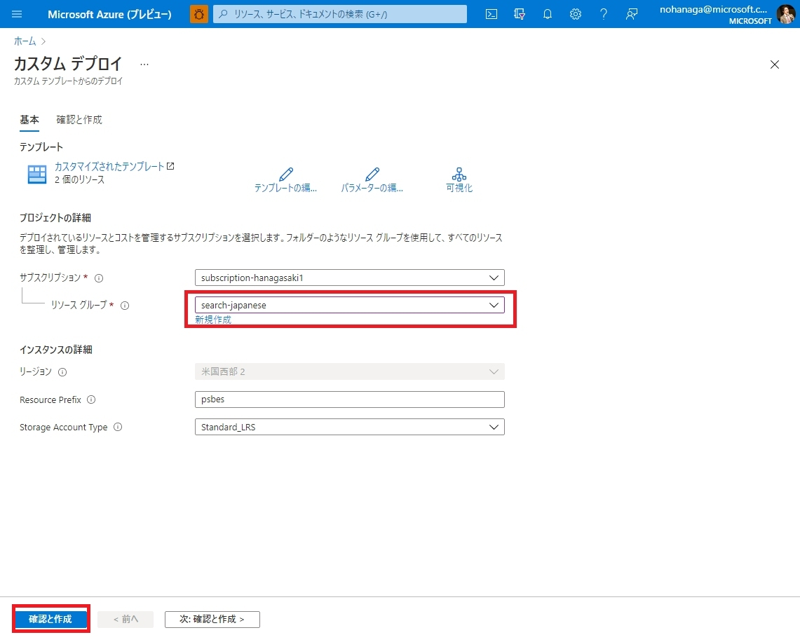

# はじめに
組織内に貯まっている大量な構造化・非構造化データから、新たな価値を見出すためのフルマネージド全文検索サービスである [Azure AI Search](https://www.youtube.com/watch?v=jOzA48ZDyC4) では、新機能のデバッグセッション（Preview）を使うと簡単にカスタムスキルを作成・編集することができます。

本ハンズオンでは、デバッグセッション機能について解説します。カスタムスキルの基礎的な解説と作成方法は[こちら](https://qiita.com/nohanaga/items/986887b82cf76dc7b0a9)をご覧ください。

# 目次
1. [デバッグセッションについて](#デバッグセッションについて)
1. [前提条件](#前提条件)
1. [デバッグセッションの作成](#デバッグセッションの作成)
1. [機能解説](#機能解説)
    1. [スキルグラフ](#スキルグラフ)
    1. [デバッグセッションの実行](#デバッグセッションの実行)
    1. [エンリッチ処理されたデータ構造](#エンリッチ処理されたデータ構造)
1. [カスタムスキルの追加](#カスタムスキルの追加)
1. [カスタムスキルのデプロイ](#カスタムスキルのデプロイ)
1. [カスタムスキルの設定](#カスタムスキルの設定)
1. [変更のコミット](#変更のコミット)
1. [出力フィールドのマッピング](#出力フィールドのマッピング)
1. [まとめ](#まとめ)


# デバッグセッションについて
Azure AI Search において、スキルやスキルセットの定義はこれまでは JSON とにらめっこしながら実行順や IN/OUT のつながりを編集する必要があり、結構とっつきにくい所がありました。

そこで 2020 年 5 月に追加されたデバッグセッション機能によって、テストファイルを指定して、そのファイルに対しスキルがどのような順で実行されているのかをライブで確認しながら編集もできるようになりました。

今回は OCR スキルの出力結果に対して外部 Web API で文字列処理を行うカスタムスキルをデバッグセッション機能を使って作成する手順をハンズオン形式で行うことで理解を深めます。2021 年 6 月現在、日本語 OCR スキルの出力結果には一文字ずつスペースが挿入される[問題](https://qiita.com/nohanaga/items/988cdb7b15b2050b364b)により、日本語 OCR 結果がうまく検索できません。今回のカスタムスキルはこの問題に対処するものです。

# 前提条件

 - [ノーコード全文検索インデックスの作成](CreateIndex.md) もしくは、[Postman を使って REST API 開発](UsingPostman.md)ハンズオンを修了済みであること

# デバッグセッションの作成

デバッグセッションは GUI 上のビジュアルエディターですので、[Azure Portal](https://portal.azure.com/) の検索サービスから、デバッグセッションタブを選択することによって実行できます。


デバッグセッションタブを開いたら、「新しいデバッグ セッション」ボタンをクリックします。


デバッグセッションの作成ウィザードが開きますので、以下を設定します。他は省略で構いません。

 - **デバッグ セッション名**：デバッグセッションの任意の名前
 - **ストレージ接続文字列**：デバッグセッションデータを保存するストレージを設定。「既存の接続を選択します」リンクをクリックして、既存の Blob ストレージ等を選択できます。デバッグ セッションが出力成果物を書き込むことができる専用のコンテナを作成して設定します。
 - **インデクサー テンプレート**：デバッグ対象のインデクサーを選択
 - **デバッグするドキュメント**：デバッグする際に入力するデータを指定できます。今回は「吾輩は猫である.png」画像を指定して利用したいので、「特定のドキュメントのデバッグ」を選択し、Azure Blob Storage 上の URL をコピーして貼り付けています。「最初のドキュメントを選択」を選ぶと、インデクサーが実行する際に一番最初にクロールするファイルが自動で選ばれます。

Azure Blob Storage からファイルの URL をコピーするには、以下のようにストレージアカウントのコンテナーに入り、ファイルをクリックしてプロパティペインを表示し、**URL** ボックスのコピーボタンをクリックします。


 入力が完了したら、「セッションの保存」ボタンをクリックします。


セッションの保存が完了した後、自動的にデバッグセッションが実行され、上のような画面に遷移します。セッションを開始すると、サービスによって、スキルセット、インデクサー、およびインデックスのコピーが作成されます。ここでは、スキルセットをテストするために先ほど指定した 1 つのドキュメントが使用されます。

セッション内で行われた変更は、先ほど設定したストレージ上にセッションデータとして保存されます。 **デバッグセッション内で行われた変更は、その変更がコミットされない限り、運用スキルセットには影響しません。** 変更をコミットすると、運用スキルセットが上書きされます。

# 機能解説
## 1. スキルグラフ
スキルグラフは、スキルセットを階層的に視覚化したものです。グラフは、スキルが実行される順に上から下に示されます。他のスキルの出力に依存するスキルは、グラフの下の方に示されます。階層内の同じレベルのスキルを並列して実行することができます。

このスキルグラフから、最も上の階層にドキュメント（コンテンツ本文）があり、そこから以下の順でデータが流れることがわかります。

1. OCR スキルと画像解析スキルにデータが渡され
2. マージスキルに OCR スキルとコンテンツ本文データが渡され
2. マージスキルの出力は言語検出スキルに渡され
2. 言語検出スキルの出力はコンテンツ本文とともにエンティティ認識スキルとキーフレーズ抽出スキルに渡され
2. 最後に出力フィールドのマッピングでインデックスに紐づける

スキルグラフ上で特定のスキルを選択してみてください。それに接続されているスキル、その入力を作成するノード、およびその出力を受け入れるノードが強調表示されます。各スキルノードでは、その種類、定義エディター、エラーまたは警告、および実行回数が表示されます。


右側のスキル詳細ペインでは、スキル定義を JSON エディターを使って編集することができたり、直接 JSON ファイルを貼り付けるといったこともできます。ここで行った変更は、セッション内だけに有効なため、運用環境を気にせずに自由に変更することができます。

また、デフォルトでは依存関係グラフが表示されますが、「コンテキスト ツリー」を選択するとエンリッチ処理されたデータ構造をベースとした保持構造とスキルとの関係を可視化することもできます。

## 2. デバッグセッションの実行

デバッグセッションの作成直後に 1 度だけセッションが実行されますが、任意のタイミングでスキルセットを実行したい場合は、画面上部のツールバーから「実行」ボタンをクリックしてください。


セッションの実行が完了すると、各スキルの箱に実行時間が表示されます。また、右側のスキル詳細ペインの実行タブにて、ソースフィールドのインプットとアウトプットの定義と、実際のデータを確認できます。スキルのソースフィールドについての解説は[こちら](https://qiita.com/nohanaga/items/986887b82cf76dc7b0a9#2-%E3%82%AB%E3%82%B9%E3%82%BF%E3%83%A0%E3%82%B9%E3%82%AD%E3%83%AB%E3%81%AE%E4%BD%9C%E6%88%90)を参照ください。パスの列にある、`</>` リンクをクリックすると、「式エバリュエーター」がポップアップします。式エバリュエーターでは、任意のパスに格納されている値をすぐに確認することができます。

スキルの出力結果が格納されている一時的な構造化情報を一覧で確認したい場合には、「エンリッチ処理されたデータ構造」タブを選択します。

## 3. エンリッチ処理されたデータ構造


「エンリッチ処理されたデータ構造」では、一時的な構造化情報をツリービュー形式の一覧で確認できます。自分がスキル定義のアウトプットフィールド設定で行った結果が正しく格納されているかどうかを確認できます。値が空欄になっていたらうまくスキルの結果が受け取れていません。自分が指定した階層に項目がない場合、アウトプットパスの設定を見直してください。

インデクサーが画像ファイルを扱う場合、スキル実行結果が格納されるパスは
`/document/normalized_images/`配下となります。

# カスタムスキルの追加
今回は、OCR スキルの実行結果から半角スペースだけを除去する文字列処理カスタムスキルを追加してみます。スキルグラフ上で「OCR スキル」を選択し、右のスキル詳細上部の「新しいスキル」をクリックします。


「技能」ドロップダウンメニューから、「カスタム Web API スキル - Azure Functions」を選択します。
すると自動的に空のスキルが作成されます。

基本的には、空の状態からスキルの定義を一つ一つ設定していくのですが、今回は OCR スキルの結果をインプットにして、テキスト処理を施してから指定のソースフィールドに格納するカスタムスキルを例に設定していきます。

# カスタムスキルのデプロイ
カスタムスキルの実行には、実際に処理を行う外部 Web API エンドポイントを用意しておく必要があります。今回は[こちら](https://github.com/nohanaga/azure-search-japanese-ocr-tips)の Github にアップロードしてある C# プログラムを Azure Functions 上に Web API エンドポイントとしてデプロイできる一通りのコードを使用します。

以下のボタンを押せば一発で Azure にデプロイできます。

<a href="https://portal.azure.com/#create/Microsoft.Template/uri/https%3A%2F%2Fraw.githubusercontent.com%2Fnohanaga%2Fazure-search-japanese-ocr-tips%2Fmaster%2Fazuredeploy.json">
</a>

デプロイボタンをクリックした後、以下の設定画面で、今回検索サービスの作成を行ったリソースグループを選択して、「確認と作成」ボタンをクリックします。



デプロイ完了後、リソースグループから Azure Functions アプリを開き、関数メニューをクリックし、「remove-spaces」関数を選択します。


関数の画面の「関数の URL の取得」ボタンをクリックし、「クリックボードにコピー」ボタンをクリックします。


# カスタムスキルの設定
デプロイ完了後、カスタム Web API スキルの「スキル JSON エディター」を選択し、以下の スキル JSON 定義をコピーして貼り付けます。

```json
{
    "@odata.type": "#Microsoft.Skills.Custom.WebApiSkill",
    "description": "remove-spaces",
    "uri": "[AzureFunctionEndpointUrl]/api/remove-spaces?code=[AzureFunctionDefaultHostKey]",
    "batchSize": 1,
    "context": "/document/normalized_images/*",
    "inputs": [
        {
          "name": "text",
          "source": "/document/normalized_images/*/text"
        }
    ],
    "outputs": [
        {
          "name": "ocrtext",
          "targetName": "ocrtext"
        }
    ]
}
```

`uri` パラメータに関しては、Azure Functions 側で取得したエンドポイント URL で置き換えます。

そして「保存」ボタンをクリックすると、以下のようにスキルグラフが更新されます。新たに追加したカスタムスキルのアウトプットがどこのスキルとも紐づいていないため、箱の下から何の矢印も伸びていません。

ただしこの状態で「実行」を行って、右ペインの「実行」タブの `ocrtext` のパスの `</>` アイコンをクリックすると実際に値が保存されていることが確認できます。


ですので、残りは接続の方法だけを編集します。もともと

`[OCR スキル]――[マージスキル]` （赤い矢印）

だったのを、

`[OCR スキル]――[カスタムスキル]――[マージスキル]`（青い矢印）

になるように**マージスキルのインプット設定**を変更します。

ちなみにスキルグラフ上からノードコネクターを D&D してつなぎ変えるなどの操作はまだ行えません。あくまで JSON 定義を可視化するためのものです。


スキルグラフの「マージスキル」を選択し、「スキルの設定」タブの `itemsToInsert` のソースフィールドを、

`/document/normalized_images/*/text` から

`/document/normalized_images/*/ocrtext` に書き換えます。

書き換えて「保存」をクリックすると、以下のようにカスタムスキルの出力がマージスキルの入力と繋がって一本のグラフが出来上がります。

では、「実行」をクリックしてみましょう。


マージスキルの出力先である `mergedText` のパスの `</>` アイコンをクリックすると式エバリュエーターの値として、OCR された文字列からスペースが除去された状態のテキストが表示されます。

# 変更のコミット

実行結果が正しいことを確認したら、デバッグセッション内で行った変更を実運用環境の設定へ適用することができます。

デバッグセッションの画面上部「変更をコミットする」ボタンをクリックしてください。


変更のコミット先のインデクサーとスキルセットの変更点を示す diff が表示されますので、問題なければ OK をクリックします。


コミット対象のスキルセットの JSON 定義を開き、実際にコミットした内容が反映されていることを確認します。

# 出力フィールドのマッピング

今回は新たにインデックスのターゲットフィールドと紐づけるソースフィールドがありませんでしたので設定は行いませんでしたが、参考までにデバッグセッション上から出力フィールドのマッピングができる機能を紹介します。


スキルグラフの一番下にある、「出力フィールドのマッピング」の箱をクリックすると、右ペインからソースフィールドとターゲットフィールドの紐づけを行うことができます。本来はインデクサー定義の JSON を直接編集する必要があるのですが、こちらから GUI を使って行うのが特に新規スキル開発に有効です。

エンリッチ処理されたデータ構造の中の項目を、インデックスのフィールドとして出力したい場合は、一番下に追加して「保存」ボタンをクリックします。

# まとめ
以上で、デバッグセッション機能を利用してカスタムスキルを追加するハンズオンを終了します。スキル開発を行う際、スキル定義のコンテキストやインプット、アウトプットは最も間違いやすい部分ですのでデバッグセッションを使って処理の流れを可視化しながら作成する方法をおススメいたします。

今回ご紹介しているカスタムスキルはとてもシンプルな作りになっているので、皆様のカスタムスキル開発の出発点としてもご利用いただけるかと思います。

