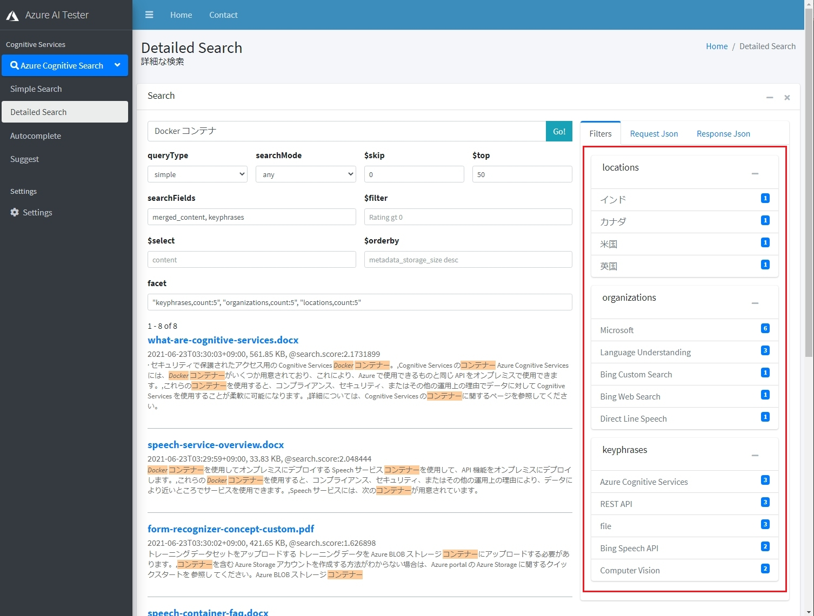
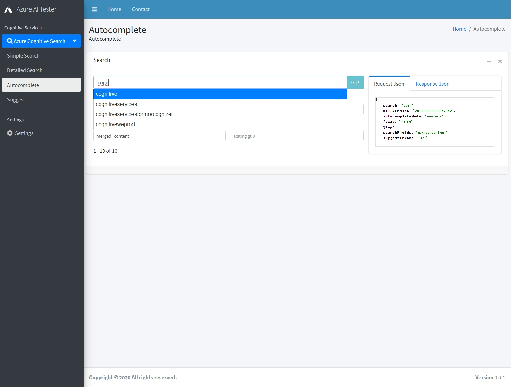
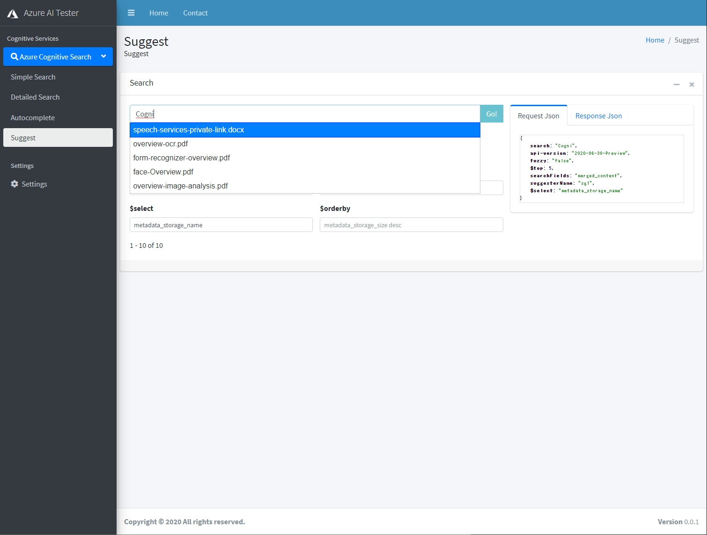

# はじめに
組織内に貯まっている大量な構造化・非構造化データから、新たな価値を見出すためのフルマネージド全文検索サービスである [Azure AI Search](https://www.youtube.com/watch?v=jOzA48ZDyC4) を使えば、誰でも簡単に AI 搭載検索エンジンを開発することができます。今回は Azure AI Search の豊富な検索機能を使いこなすためのハンズオンをご紹介します。

# 目次
1. [豊富な検索機能を使いこなす](#豊富な検索機能を使いこなす)
1. [前提条件](#前提条件)
1. [選択($select)](#選択select)
1. [ソート($orderby)](#ソートorderby)
1. [フィルター($filter)](#フィルターfilter)
1. [ファセット(facet)](#ファセットfacet)
1. [オートコンプリート](#オートコンプリート)  
1. [サジェスト](#サジェスト)  
1. [まとめ](#まとめ)  


# 豊富な検索機能を使いこなす
Azure AI Search には、フリーテキスト検索から高度に指定されたクエリ パターンまで、さまざまなシナリオをサポートする豊富なクエリ言語が用意されています。このハンズオンでは、クエリ要求と、作成できるクエリの種類について説明します。

検索クエリの発行は、REST API で行います。検索クエリの送信には前回導入した Postman を使ってもよいですし、今回のハンズオン用に私が作成したクエリテスター GUI を利用することもできます。

本ハンズオンでは、Simple Cognitive Search Tester を使用します。

# 前提条件

 - [フルテキスト検索](FullTextSearch.md) ハンズオンを修了済みであること
 - Simple Cognitive Search Tester か Postman が導入済みであること

# 選択($select)
結果セットに含めるコンマ区切りのフィールドの一覧。この句には、取得可能としてマークされているフィールドのみを含めることができます。指定しない場合、または * に設定した場合は、スキーマで取得可能とマークされているすべてのフィールドが含まれます。

$select パラメータに以下のように指定します。

```
metadata_storage_name
```
結果の value 配列に @search.score と metadata_storage_name しか含まれなくなります。Simple Cognitive Search Tester をお使いの場合、右側タブの「Response Json」に REST API の結果が表示されます。

[Azure AI Search での OData $select 構文](https://docs.microsoft.com/azure/search/search-query-odata-select)

# ソート($orderby)
評価や場所などの値によって結果を並べ替える場合に使用します。 それ以外の場合、既定では、関連性スコア（@search.score）を使用して結果が順位付けされます。 このパラメーターの候補とするために、このフィールドには 並べ替え可能 の属性を付ける必要があります。

$orderby パラメータに以下のように指定します。

```
metadata_storage_last_modified desc
```
ドキュメントの最終更新が新しいもの順にソートされます。

### 問題

1. ファイルサイズが大きい順にソートされるようにしてください。
1. ファイルの拡張子ごとにソートした後、ファイルの最終更新が新しい順にソートされるようにしてください。

[Azure AI Search での OData $orderby 構文](https://docs.microsoft.com/azure/search/search-query-odata-orderby)

# フィルター($filter)
フィルター構文は、単独で使用することも、"search" と一緒に使用することもできる OData 式です。一緒に使用した場合、"filter" が最初にインデックス全体に適用され、次にフィルター処理の結果に対して検索が実行されます。フィルターはクエリのパフォーマンス向上に役立つ手法です。フィルターを使うと、検索クエリで処理が必要なドキュメントの数が減ります。フルテキスト検索とは異なり、フィルター値または式では厳密な一致のみが返されます。

$filter パラメータに以下のように指定します。

## 文字列のフィルター

```
metadata_storage_file_extension eq '.pdf'
```
ドキュメントの拡張子が PDF のものを検索します。


## 数値フィルター

```
metadata_storage_size lt 102400
```
ドキュメントのファイルサイズが 102,400 byte より小さいものを検索します。

## 日付フィルター

```
metadata_storage_last_modified gt 2021-06-23T00:00:00Z
```
ドキュメントの最終更新が 2021-06-23T00:00:00Z 以降のファイルを検索します。

[Azure AI Search での OData $filter 構文](https://docs.microsoft.com/azure/search/search-query-odata-filter)

## コレクション型のフィルター
Collection(Edm.String) タイプのフィールドの中から、一致する値を検索したい場合は以下の構文を使用します。
```
imageTags/any(t: t eq 'person')
```
imageTags フィールドに person を含むドキュメントを検索します。

[Azure AI Search での OData コレクション演算子 - any と all](https://docs.microsoft.com/azure/search/search-query-odata-collection-operators)

### 問題

1. ドキュメントに人(person)が含まれていて、かつ、メガネ(glasses)をかけている写真を含むドキュメントを 1件に特定してください。
1. ビル・ゲイツ(Bill Gates)の写真を含むドキュメントを 1件に特定してください。
1. ファイルサイズが 100 KB から 500 KB の範囲にあるドキュメントを検索してください。

# ファセット(facet)
ファセット ナビゲーションは、検索アプリケーションで自律型のドリルダウン ナビゲーションを提供するフィルター処理メカニズムです。 「ファセット ナビゲーション」という用語は聞き慣れないかもしれませんが、気づかずに使っていることもあります。 次の例に示すように、ファセット ナビゲーションは結果のフィルター処理に使用されるカテゴリです。



ファセットは検索結果に応じて動的に生成されます。実プロダクトでは、右のファセットの値をクリックもしくはチェックしたら、その値をフィルター条件に加えて再検索するなどの対話的 UI を設計します。

facet パラメータに以下のように指定します。

```
"keyphrases,count:5", "organizations,count:5", "locations,count:5"
```

上記はファセットとして、keyphrases、organizations、locations フィールドから生成し、それぞれ上位 5 位を出力します。指定できるのはファセット可能にマークしたフィールドである必要があります。"count" の他に有効な値は、"sort"、"values"、"interval"、および "timeoffset" です。

```
"metadata_storage_size,interval:10000"
```

このように指定すると、ドキュメントのファイルサイズを 10,000 バイトごとに区分サマリーして表示します。
より詳細な解説は、[クエリ パラメーター](https://docs.microsoft.com/rest/api/searchservice/Search-Documents#query-parameters)の facet 項目を参照してください。

### 問題

1. keyphrases フィールドのファセットを上位 20 件まで表示できるようにします。
1. ファイルの拡張子をファセットに追加してください。上位 5 件まで表示できるようにします。
1. ファイルの最終更新日付を "日にち" ごとに区分分けして表示できるようにします。


[Azure AI Search へのファセット ナビゲーションの実装方法](https://docs.microsoft.com/azure/search/search-faceted-navigation)

# オートコンプリート
検索インデックス内の既存の用語を使用して、部分的に型指定されたクエリ入力を完了します。たとえば、クエリ入力が "medic" の場合、オートコンプリート API は "medicare"、"medicaid"、"medicine" を返します (これらの用語がインデックスに含まれている場合)。内部的には、検索エンジンは、 Suggester が構成されているフィールド内の一致する用語を検索します。

Simple Cognitive Search Tester にはオートコンプリートを実際に試すことができる機能があります。サイドメニューから、「Autocomplete」をクリックしてください。

Postman を利用している方は、API 一覧の「09 - Autocomplete」を利用してください。



検索ボックスに一文字入力するたびに jQuery UI Autocomplete が Autocomplete API と連携して文字列の候補ドロップダウンを表示します。

[オートコンプリート (Azure AI Search REST API)](https://docs.microsoft.com/rest/api/searchservice/autocomplete)

# サジェスト
サジェスト対応フィールドで一致する値を検索し、一致を含む**ドキュメント**を返す、入力としての検索クエリです。たとえば、 city フィールドで候補を有効にした場合、「sea」と入力すると、そのフィールドの "Seattle"、"sea vs-tac"、および "seaside" (すべての実際の市区町村名) を含むドキュメントが生成されます。

Simple Cognitive Search Tester にはサジェストを実際に試すことができる機能があります。サイドメニューから、「Suggest」をクリックしてください。

Postman を利用している方は、API 一覧の「10 - Suggester」を利用してください。



[サジェスト (Azure AI Search REST API)](https://docs.microsoft.com/rest/api/searchservice/suggestions)


# まとめ
本ハンズオンでは、Azure AI Search の豊富な検索機能を使いこなせるようになりました。細かい機能をすべてカバーしたわけではありませんので、各機能の Docs を参照してさらに深堀して体験していただければと思います。