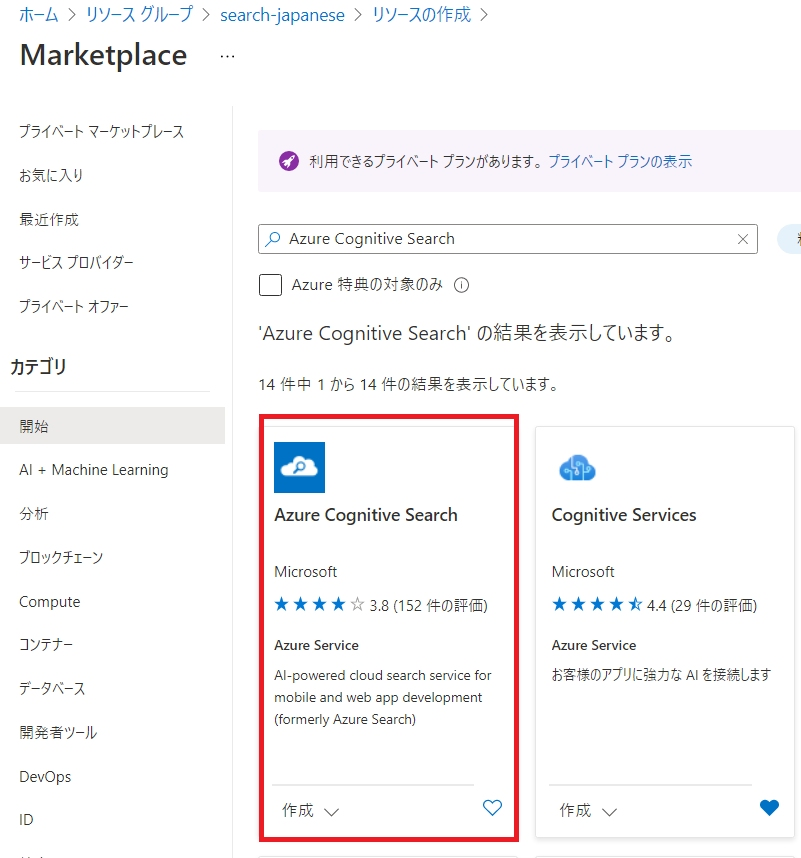
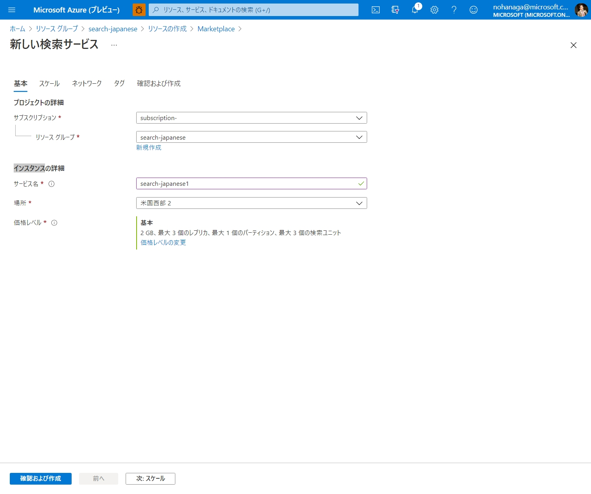
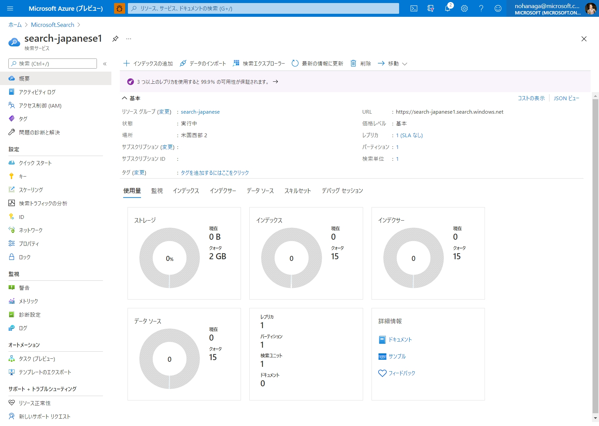
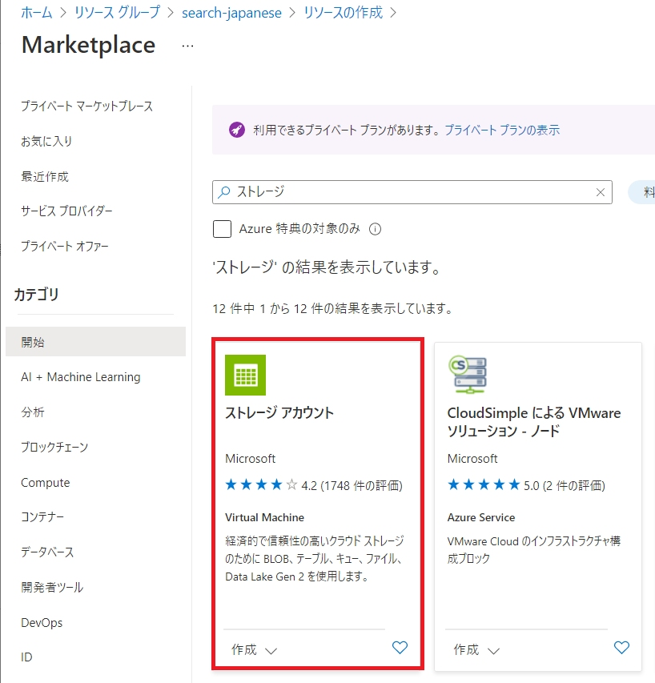
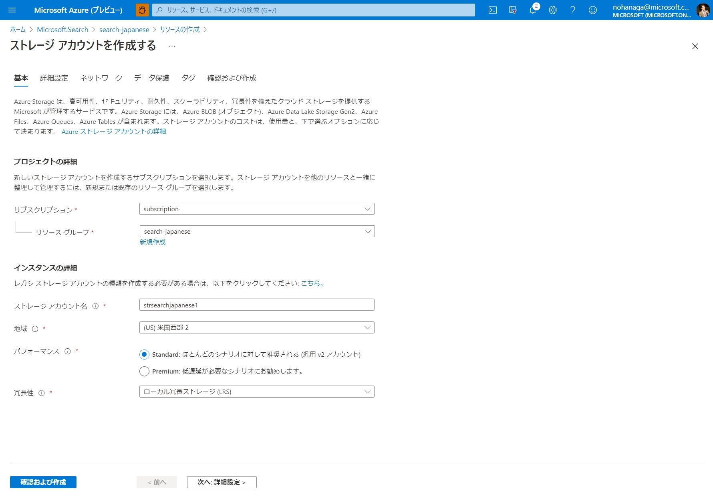
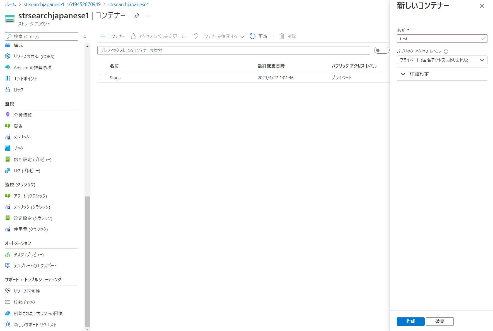

# はじめに
組織内に貯まっている大量な構造化・非構造化データから、新たな価値を見出すためのフルマネージド全文検索サービスである [Azure Cognitive Search](https://www.youtube.com/watch?v=jOzA48ZDyC4) を使えば、誰でも簡単に AI 搭載検索エンジンを開発することができます。今回はノーコード、画面上の操作だけで簡単に検索インデックスを作成する手順をハンズオン形式でご紹介します。

# 目次
1. [Azure Cognitive Search とは](#Azure-Cognitive-Search-とは)
1. [検索サービスの作成](#検索サービスの作成)
1. [Azure Blob Storage の作成](#azure-blob-storage-の作成)
1. [インデックスの作成](#インデックスの作成)
    1. [データに接続](#1-データに接続)
    1. [コグニティブ スキルの追加](#2-コグニティブ-スキルの追加)
    1. [インデックスのカスタマイズ](#3-インデックスのカスタマイズ)
1. [インデクサーの作成](#4-インデクサーの作成)
1. [インデクサーの実行](#インデクサーの実行)
1. [スキルセットの修正](#スキルセットの修正)
1. [デモアプリの作成](#デモアプリの作成)
1. [参考リンク](#参考リンク)

# 検索サービスの作成
[Azure Portal](https://portal.azure.com/) にログインし、新規でリソースグループを作成します。
作成したリソースグループの中に、検索サービスを追加します。マーケットプレイスで、「Azure Cognitive Search」と検索してください。

新しい検索サービスウィザードで、必要事項を入力します。価格レベルでは、必要なプランを選択します。こちらの[料金表](https://azure.microsoft.com/pricing/details/search/)も参考にしてください。無料プランで始めることもできます。

デプロイが完了し、作成された検索サービスをクリックすると、以下のようなポータル画面が表示されます。

このポータル画面上でインデックス、インデクサー、データソース、スキルセットの作成や編集を行うことができます。

# Azure Blob Storage の作成

ここで一旦リソースグループに戻り、検索対象のデータを保管するためのストレージアカウントを追加します。
マーケットプレイスで、「ストレージ」と入れて検索してください。

今回は、ドキュメントファイルや画像データを保管できるシンプルな Blob Storage があればよいので、以下のように設定します。

ストレージアカウントのデプロイが完了しましたら、ストレージアカウントの左メニューから「コンテナー」を選択し、以下のように新しいコンテナーを作成します。

作成したコンテナーの中に入り、サンプル画像ファイルを 1 枚アップロードします。PDF やワード、エクセルなど他にも検索してみたいファイルがある方は、こちらにアップロードしてください。ファイルが大量にある場合は、[Azure Storage Explorer](https://azure.microsoft.com/features/storage-explorer/) を使ってアップロードすることもできます。
サポートしているファイルフォーマットの一覧は[こちら](https://docs.microsoft.com/azure/search/search-blob-storage-integration#supported-content-types)を参照してください。

