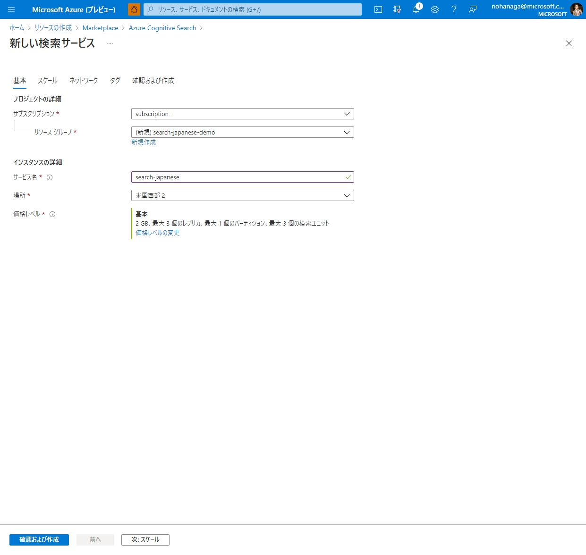
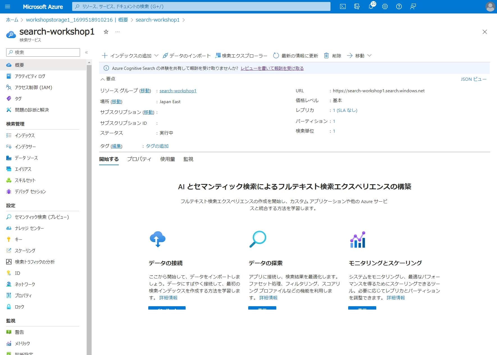
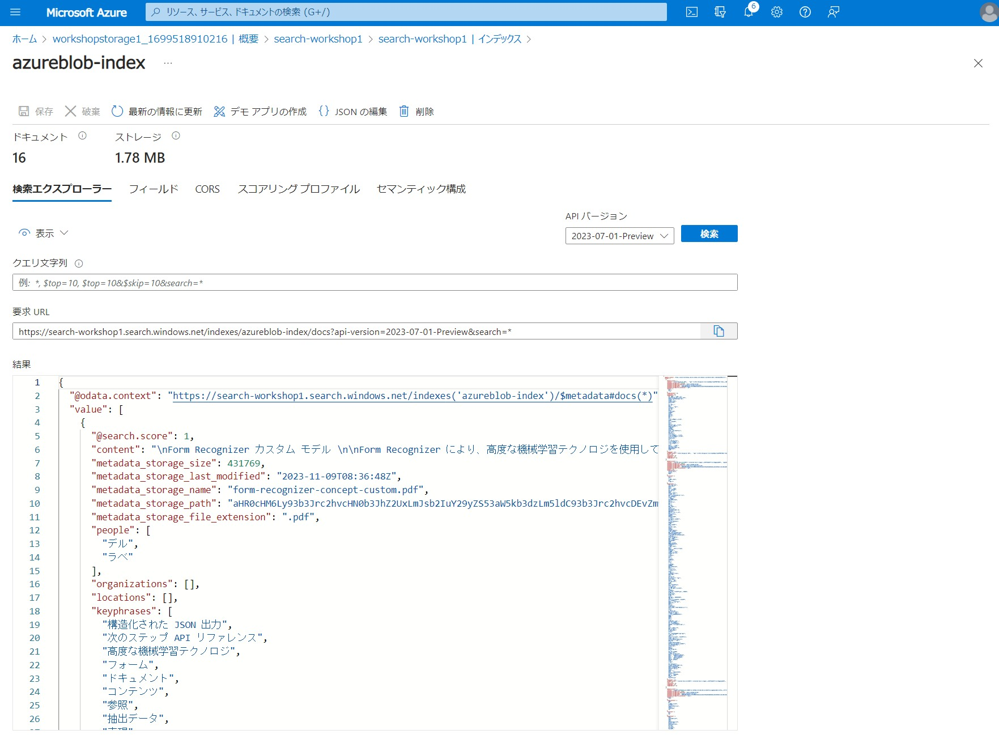
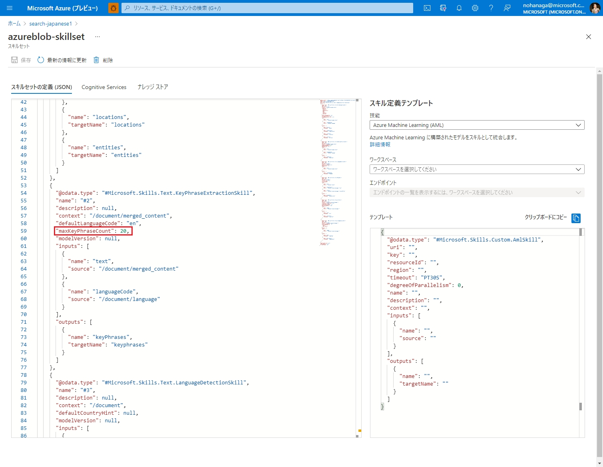
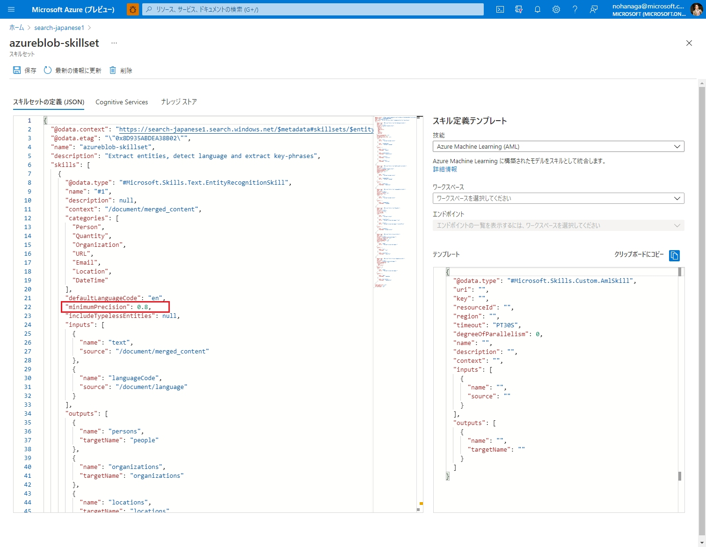

# はじめに
組織内に貯まっている大量な構造化・非構造化データから、新たな価値を見出すためのフルマネージド全文検索サービスである [Azure Cognitive Search](https://www.youtube.com/watch?v=jOzA48ZDyC4) を使えば、誰でも簡単に AI 搭載検索エンジンを開発することができます。今回はノーコード、画面上の操作だけで簡単に検索インデックスを作成する手順をハンズオン形式でご紹介します。

# 目次
1. [Azure Cognitive Search とは](#Azure-Cognitive-Search-とは)
1. [検索サービスの作成](#検索サービスの作成)
1. [Azure Blob Storage の作成](#azure-blob-storage-の作成)
1. [インデックスの作成](#インデックスの作成)
    1. [データに接続](#1-データに接続)
    1. [コグニティブ スキルの追加](#2-コグニティブ-スキルの追加)
    1. [インデックスのカスタマイズ](#3-インデックスのカスタマイズ)
1. [インデクサーの作成](#4-インデクサーの作成)
1. [インデクサーの実行](#インデクサーの実行)
1. [スキルセットの修正](#スキルセットの修正)
1. [デモアプリの作成](#デモアプリの作成)
1. [参考リンク](#参考リンク)


# 検索サービスの作成
[Azure Portal](https://portal.azure.com/) にログインし、「リソースの作成」をクリックします。マーケットプレイスで、「Azure Cognitive Search」と検索し、以下のサービスを見つけて「作成」をクリックしてください。


新しい検索サービスウィザードで、必要事項を入力します。リソースグループを新たに作成する場合、**新規作成** をクリックし、新しく作成したいリソースグループ名を記入します。価格レベルでは、必要なプランを選択します。こちらの[料金表](https://azure.microsoft.com/pricing/details/search/)も参考にしてください。無料プランで始めることもできます。



デプロイが完了し、作成された検索サービスをクリックすると、以下のようなポータル画面が表示されます。



このポータル画面上でインデックス、インデクサー、データソース、スキルセットの作成や編集を行うことができます。

<BR>

# Azure Blob Storage の作成

ここで一旦リソースグループに戻り、検索対象のデータを保管するためのストレージアカウントを追加します。
マーケットプレイスで、「ストレージ」と入れて検索してください。


今回は、ドキュメントファイルや画像データを保管できるシンプルな Blob Storage があればよいので、以下のように設定します。


ストレージアカウントのデプロイが完了しましたら、ストレージアカウントの左メニューから「コンテナー」を選択し、以下のように新しいコンテナーを作成します。


作成したコンテナーの中に入り、検索したいファイルをアップロードします。画像や PDF、ワード、エクセルファイルなどをこちらにアップロードしてください。ファイルが大量にある場合は、[Azure Storage Explorer](https://azure.microsoft.com/features/storage-explorer/) を使ってアップロードすることもできます。
サポートしているファイルフォーマットの一覧は[こちら](https://docs.microsoft.com/azure/search/search-blob-storage-integration#supported-content-types)を参照してください。

今回のワークショップ用に [Github](https://github.com/nohanaga/Azure-Cognitive-Search-Workshop/tree/main/sample) に検索用の PDF, Word, 画像ファイルを 16 個用意してありますので、すべてローカルにダウンロードして、Blob Storage にアップロードします。

<BR>

# インデックスの作成

それでは、先ほど作成した Blob Storage 内を検索するためのインデックスの作成を行います。

## 1. データに接続


検索サービスのポータルに戻り、ツールバーの「データのインポート」をクリックします。


データのインポートウィザードでは、データソースに「Azure BLOB ストレージ」を選択し、データソース名を入力し、「既存の接続を選択します」リンクをクリックします。

ちなみに Azure Cognitive Search が対応しているデータソースには、Azure Cosmos DB や Azure SQL Database などがあり、2021 年 3 月には、[SharePoint Online (Preview)](https://docs.microsoft.com/azure/search/search-howto-index-sharepoint-online) にも対応しました。サポートしているデータソースの一覧は[こちら](https://docs.microsoft.com/azure/search/search-indexer-overview#supported-data-sources)にあります。


先ほどのデータのインポート画面のコンテナー名に、選択したコンテナーが自動で入力されたことを確認し、「次：コグニティブ スキルを追加します（省略可能）」ボタンをクリックします。

## 2. コグニティブ スキルの追加

ここでは、検索インデックスをより豊かにするための、AI エンリッチメントを追加できます。AI エンリッチメントでは、[Azure Cognitive Services](https://azure.microsoft.com/services/cognitive-services/) の機能が使われるため、基本的に[利用料がかかります](https://docs.microsoft.com/azure/search/cognitive-search-attach-cognitive-services)。ただし今回はハンズオンですので、「Cognitive Services をアタッチする」では設定を行いません。そうすると自動で無料 (制限付きのエンリッチメント) リソースがセットされます。ただしインデクサーごとに、1 日あたり 20 ドキュメントまでのエンリッチに制限されます。 


今回は、上図のようにチェックしてください。サンプル画像から、OCR を使って文字を読み取り、その文字に対して、エンティティの抽出等のテキスト解析を行います。また写真ファイルをアップロードする場合には、画像認識のスキルを有効化しておくことで画像からメタデータを抽出できます。

チェックが完了したら、「次：対象インデックスをカスタマイズします」をクリックします。

## 3. インデックスのカスタマイズ


対象インデックスのカスタマイズウィザードでは、検索インデックスとして格納するフィールドごとに、取得可能、フィルター可能、ソート可能、ファセット可能、検索可能、アナライザー、サジェスターという一般的な検索インデックスとしての設定を行う必要があります。各機能の説明は冒頭の動画でするとして、**今回は上図のようにチェックしてください**。

アナライザーにはデフォルトで、標準 Lucene アナライザーがセットされていますが、これは西洋語用のもので日本語の解析に対応していませんので、日本語の解析が必要なフィールドには、**日本語アナライザー**を設定する必要があります。日本語のアナライザーには Lucene アナライザーと、Microsoft アナライザーの [2 種類](https://docs.microsoft.com/azure/search/index-add-language-analyzers#comparing-lucene-and-microsoft-analyzers)が用意されていますが、それぞれトークナイズの手法に違いがあるので、要件によって選択するようにしてください。今回は**日本語 Microsoft アナライザー**を使用します。

 * `content`: ドキュメントの本文が格納されます。文字解析可能なドキュメントはここに値が格納されます。中身は日本語として解析される必要があるため、[日本語 Microsoft アナライザー](https://docs.microsoft.com/azure/search/index-add-language-analyzers)をセットします。
  * `metadata_storage_size`: BLOB のサイズ (バイト単位)です。ファイルサイズでフィルター、ソート、ファセットを可能にするために、取得可能、フィルター可能、ソート可能、ファセット可能にチェックします。
  * `metadata_storage_last_modified`: 前回変更時の BLOB のタイムスタンプです。タイムスタンプでフィルター、ソート、ファセットを可能にするために、取得可能、フィルター可能、ソート可能、ファセット可能にチェックします。
 * `metadata_storage_name`: BLOB のファイル名です。今回は検索結果に表示するために、取得可能にチェックします。
  * `metadata_storage_file_extension`: BLOB の拡張子です。拡張子でフィルター、ソート、ファセットを可能にするために、取得可能、フィルター可能、ソート可能、ファセット可能にチェックします。
 * `people`: [人物エンティティ](https://docs.microsoft.com/azure/search/cognitive-search-skill-entity-recognition)が格納されます。日本語で解析できるようにします。
 * `organizations`: [組織エンティティ](https://docs.microsoft.com/azure/search/cognitive-search-skill-entity-recognition)が格納されます。日本語で解析できるようにします。
 * `locations`: [位置エンティティ](https://docs.microsoft.com/azure/search/cognitive-search-skill-entity-recognition)が格納されます。日本語で解析できるようにします。
 * `keyphrases`: [重要語](https://docs.microsoft.com/azure/search/cognitive-search-skill-keyphrases)が格納されます。日本語で解析できるようにします。
 * `language`: [言語検出スキル](https://docs.microsoft.com/azure/search/cognitive-search-skill-language-detection)による言語推定結果が格納されます。ISO 3166-1 alpha-2 の 2 文字の国番号が入るのでアナライザーはデフォルトにしておきます。
 * `merged_content`: ドキュメントの本文と、OCR による読み取り結果をマージした結果が格納されます。日本語で解析できるようにします。Suggester にチェックをいれることで、このフィールドが[オートコンプリートとサジェスト機能](https://docs.microsoft.com/azure/search/index-add-suggesters)対応になります。
 * `text`: [OCR スキル](https://docs.microsoft.com/azure/search/cognitive-search-skill-ocr)の読み取り結果が格納されます。日本語で解析できるようにします。
 * `layoutText`: [OCR スキル](https://docs.microsoft.com/azure/search/cognitive-search-skill-ocr) で抽出されたテキストと､そのテキストが検出された座標を記述した配列が格納されます。日本語で解析できるようにします。
 * `imageTags`: [画像解析](https://docs.microsoft.com/azure/search/cognitive-search-skill-image-analysis)して画像のコンテンツに関係する単語の一覧が格納されます。今回は設定省略します。（日本語にも対応しています）
 * `imageCaption`: [画像解析](https://docs.microsoft.com/azure/search/cognitive-search-skill-image-analysis)して画像のコンテンツを説明するための文が格納されます。今回は設定省略します。（日本語にも対応しています）

 フィールドごとに一つ一つ設定していくのが面倒くさいと思った方はご安心ください。これらの設定はすべて JSON 形式でエクスポートできますので、JSON 形式で編集などをして、[Postman](https://www.postman.com/) を使って REST API 経由でインデックスに登録することができます。今回はインデックスフィールドについて学んでいただくため、一つずつ手動でチェックしていただきます。

設定が完了しましたら、「次：インデクサーの作成」をクリックしてください。

## 4. インデクサーの作成

最後にインデクサーの作成を行います。インデクサーは、外部データソースから検索サービスの検索インデックスにドキュメントとコンテンツを転送するための、自動化されたワークフローを提供します。ここでは、データをプルする頻度をスケジューリングすることや、検索対象のファイルに対する処理の各種設定を行うことができます。


今回は、`metadata_storage_path` をドキュメントキーとしているため、`Base-64 エンコード キー` にチェックを入れておきます。
また、スケジュール設定はせず、デフォルトの `1度` にセットしておきます。

設定が完了したら、「送信」ボタンをクリックします。

<br>

# インデクサーの実行

さきほどインデクサーの実行スケジュールを `1度` にしておいたため、作成直後に自動的に 1 度だけ実行されます。


「インデクサー」タブの対象インデクサーのステータスが `実行中` となっていると思います。これが `成功` となればインデキシング完了です。

<br>

# インデックスの CORS 設定

ブラウザーではすべてのクロスオリジン要求が禁止されるので、既定ではクライアント側 JavaScript で API を呼び出すことはできません。 インデックスに対するクロスオリジン クエリを許可するには、corsOptions 属性を設定することによって、CORS (クロスオリジン リソース共有) を有効にします。


「インデックス」タブをクリックし、インデックス名を選択します。


インデックス内の「CORS」タブから、「許可されたオリジンの種類」を **すべて** に設定して、「保存」をクリックします。

# インデックスの検索

作成したインデックスの中身は、ポータル上で検索することができます。


「インデックス」タブをクリックし、インデックス名を選択します。



すると検索エクスプローラー画面が表示されます。ここで、検索クエリーのテストや、実行結果の確認をすることができます。
ひとまずクエリ文字列に何も入れずに「検索」ボタンをクリックしてみてください。全件が検索されます。

<br>

# スキルセットの修正

## OCR スキルの言語設定

OCR スキルはデフォルトで英語の設定になっているため、そのまま検索しようとするとうまく検索できません。OCR を日本語に対応させる場合は一度ポータルに戻り、「スキルセット」タブをクリックし、スキルセット名を選択してください。


スキルセットは、各スキルの定義とその実行順を JSON 形式で定義したものです。ポータル画面から、閲覧と直接編集を行えます。


以下のように、`#Microsoft.Skills.Vision.OcrSkill` の部分の、`defaultLanguageCode` を `ja` に変更し、「保存」ボタンをクリックします。もし OCR したいドキュメントの言語がこの時点で不明の場合、`unk` と設定することで、言語が自動検出されます。

```json
    {
      "@odata.type": "#Microsoft.Skills.Vision.OcrSkill",
       ...
      "defaultLanguageCode": "ja",
       ...
    }
```

## キーフレーズ抽出スキルの上限設定

ドキュメントから抽出するキーフレーズの最大数を 20　に制限します。



以下のように、`#Microsoft.Skills.Text.KeyPhraseExtractionSkill` の部分の、`maxKeyPhraseCount` を `20` に変更し、「保存」ボタンをクリックします。

```json
    {
      "@odata.type": "#Microsoft.Skills.Text.KeyPhraseExtractionSkill",
       ...
      "maxKeyPhraseCount": 20,
       ...
    }
```

## エンティティ認識スキルの信頼度スコア閾値設定
ドキュメントから抽出するエンティティの信頼度スコアの閾値を 0.8 に制限します。信頼度スコア 0.8 よりも小さいエンティティは返却されません。



以下のように、`#Microsoft.Skills.Text.EntityRecognitionSkill` の部分の、`minimumPrecision` を `0.8` に変更し、「保存」ボタンをクリックします。

```json
    {
      "@odata.type": "#Microsoft.Skills.Text.EntityRecognitionSkill",
       ...
      "minimumPrecision": 0.8,
       ...
    }
```

保存が完了したら、今度はポータルからインデクサーを開き、「リセット」ボタンを押してから「実行」ボタンを押します。
[リセット](https://docs.microsoft.com/azure/search/search-howto-run-reset-indexers#reset-an-indexer)を行うことで、一度インデキシングされたデータをクリアして、再度インデキシングすることができるようになります。


<br><br>

# デモアプリの作成

Azure Cognitive Search の機能は基本的に REST API での提供となりますが、デモのために簡易的な Web 検索フロントエンドを作成してくれる機能があります。検索エクスプローラー画面の上にある「デモ アプリの作成」ボタンをクリックしてください。


デモ アプリの作成ウィザードでは、検索画面に表示するフィールドの設定を行うことができます。
まずは検索結果画面に表示したいフィールドを選択して「次へ」をクリックします。


サイドバー設定では、検索画面の左側に表示されるフィルター項目を設定することができます。この設定を行えば、[ファセットフィルター](https://docs.microsoft.com/azure/search/search-filters-facets)機能のデモをすることができます。


[インデックスのカスタマイズ](#3-インデックスのカスタマイズ)セクションで、Suggester の設定を行っていたので、この画面でサジェスト対象のフィールド `merged_content` を選択します。

最後に、「デモ アプリの作成」ボタンをクリックすれば、デモ用の HTML ファイルがダウンロードできます。


ローカルでダウンロードした HTML ファイルをブラウザで開き、上部の検索ボックスにキーワードを入れると、このように検索結果が表示されます。簡易的ですが、検索デモとして使うことができます。左ペインは、検索結果に応じて動的に生成される[ファセットフィルター](https://docs.microsoft.com/azure/search/search-filters-facets)です。検索ボックスに何か単語を入力すると、[サジェスト機能](https://docs.microsoft.com/azure/search/search-add-autocomplete-suggestions#suggestions)によるドロップダウンが表示されます。

※注意：HTML ファイル内に接続情報を含んでいるため、このファイルをそのまま運用環境に用いることはできません。

# まとめ
以上で、Azure Portal 上で Azure Cognitive Search のインデックス作成から検索までの流れを体験いただきました。
この次は、[Postman を使った REST API 経由での作成方法](https://qiita.com/nohanaga/items/633b4f3d4ac77154d286)についてご紹介したいと思います。