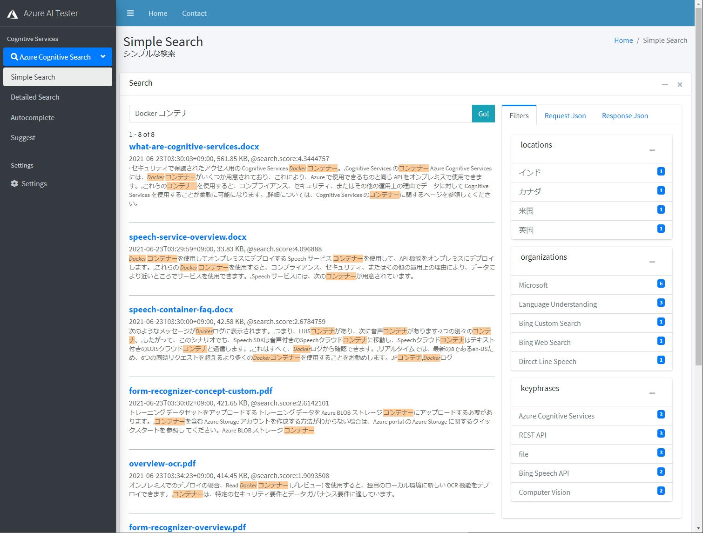
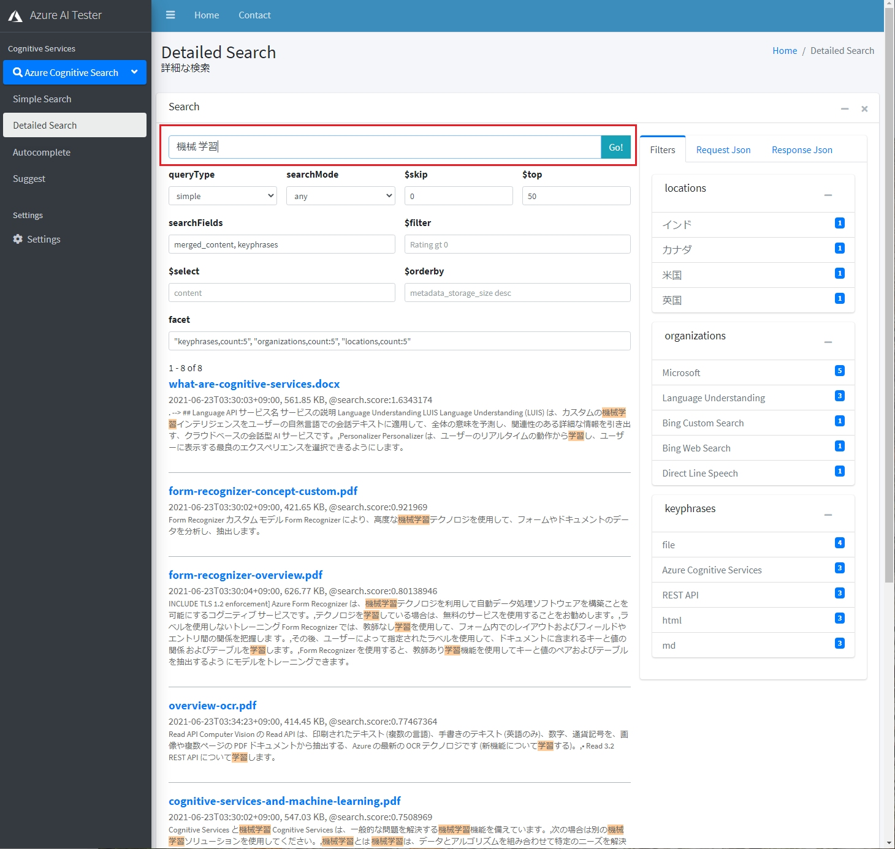
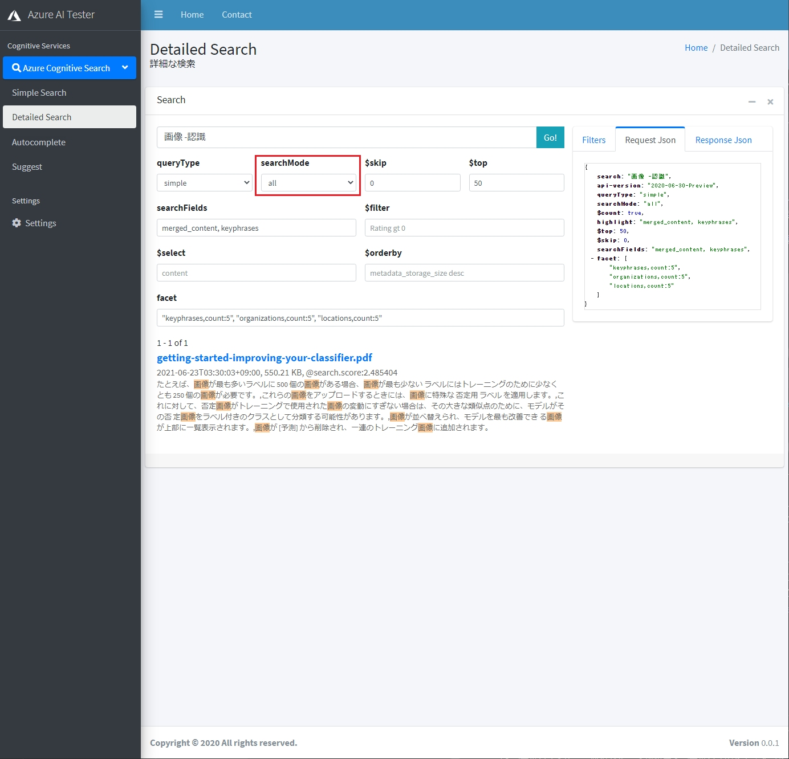
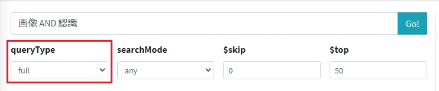

# はじめに
組織内に貯まっている大量な構造化・非構造化データから、新たな価値を見出すためのフルマネージド全文検索サービスである [Azure Cognitive Search](https://www.youtube.com/watch?v=jOzA48ZDyC4) を使えば、誰でも簡単に AI 搭載検索エンジンを開発することができます。今回は Azure Cognitive Search のフルテキスト検索機能をハンズオン形式でご紹介します。

# 目次
1. [フルテキスト検索](#フルテキスト検索)
1. [前提条件](#前提条件)
1. [事前準備](#事前準備)
1. [フルテキスト検索の実践](#フルテキスト検索の実践)
1. [Simple クエリ パーサー](#simple-クエリ-パーサー)
    1. [ブール演算子](#ブール演算子)
1. [Full Lucene クエリ パーサー](#full-lucene-クエリ-パーサー)
    1. [ブール演算子](#ブール演算子-1)
    1. [フィールド検索](#フィールド検索)
    1. [ワイルドカード検索・正規表現検索](#ワイルドカード検索正規表現検索)
    1. [近接検索](#近接検索)
    1. [あいまい検索](#あいまい検索)
    1. [用語ブースト](#用語ブースト)
1. [まとめ](#まとめ)  


# フルテキスト検索
Azure Cognitive Search には、フリーテキスト検索から高度に指定されたクエリ パターンまで、さまざまなシナリオをサポートする豊富なクエリ言語が用意されています。このハンズオンでは、クエリ要求と、作成できるクエリの種類について説明します。

検索クエリの発行は、REST API で行います。検索クエリの送信には[前回](UsingPostman.md)導入した Postman を使ってもよいですし、今回のハンズオン用に用意したクエリテスター GUI を利用することもできます。

本ハンズオンでは、Simple Cognitive Search Tester を使用します。

# 前提条件

 - [ノーコード全文検索インデックスの作成](CreateIndex.md) もしくは、[Postman を使って REST API 開発](UsingPostman.md)ハンズオンを修了済みであること

# 事前準備

## Simple Cognitive Search Tester のダウンロード
Simple Cognitive Search Tester は、今回のハンズオン用に私が用意したクエリテスト用の HTML ベース GUI です。極めてシンプルに作ってあるのでダウンロードして解凍するだけで、インストール作業は一切必要ありません。[こちら](https://github.com/nohanaga/Azure-Cognitive-Search-Workshop/raw/89092a48ec9017db84210d3c485b4744d185843b/gui/simple-cognitive-search-tester.zip)からダウンロードできます。ダウンロードしたら、**simple-cognitive-search-tester.zip** ファイルを任意のフォルダに解凍してください。

## 接続情報の設定

simple-cognitive-search-tester ディレクトリ内に移動し、**settings.html** をブラウザで開きます。


検索クエリの実行に必要な、以下の情報を入力して「Save」をクリックします。入力した接続情報は、ブラウザの [localStorage](https://developer.mozilla.org/ja/docs/Web/API/Window/localStorage) に保存されます。

* `search_service`: Azure Cognitive Search サービスリソースの名前。検索対象の検索サービス名を設定します。
* `index_name`: 検索インデックスの名前。検索対象のインデックス名を指定します。
* `querykey`: Azure Cognitive Search サービスの API キー。検索クエリ用途のみですので、クエリキーのほうを使用します。これは Azure Portal の検索サービスの「設定メニュ→キー」からコピーします。

**注意**：localStorage に API キーを保管するのはセキュリティ上問題があります。今回一時的な使用のためだけに用意しています。必ずデモ終了後、Delete ボタンを押して削除してください。localStorage に API キーを保管したくない方は、各検索 html ページのソースコードの接続情報変数を直接編集してください。

接続情報が正しければ、インデックスを検索することができます。サイドメニューから、「Simple Search」をクリックして、検索ワードを入れて Enter キーを押してみてください。




# フルテキスト検索の実践
# Simple クエリ パーサー
Azure Cognitive Search には、2 種類のクエリ パーサーが用意されており、それぞれで実現可能な検索機能が異なります。設定できるのは、デフォルトの **Simple クエリ パーサー** (フルテキスト検索に最適) または、正規表現、近接検索、ファジー検索、ワイルドカード検索、フィールド検索、用語ブーストなど高度なクエリ構成で使用される **Full Lucene クエリ パーサー**です。

Simple Cognitive Search Tester では、「Simple Search」にデフォルトで Simple クエリ パーサーをセットしてあります。Full Lucene クエリ パーサーを使用したい場合は、「Detailed Search」の方を開いて **queryType** に **full** をセットします。

## ブール演算子
Simple クエリ パーサーでは、AND、OR、NOT の論理式をサポートするために、文字 (+, -, |) の形式のブール演算子をサポートしています。

たとえば、

```
画像 認識
```

を検索するとします。「Detailed Search」を開いて、検索ボックスに上記ワードを入力します。Detailed Search ではデフォルトで、Simple クエリ パーサーがセットされています。



Postman などの REST API でクエリを発行したい方は、以下のパラメータでクエリを投げてください。

```json
    {  
      "search": "画像 認識",
      "api-version": "2020-06-30"
    }
```

ドキュメントは 13 件検索されました。ワードをスペースで区切っただけの場合、それぞれのトークンは 論理和 OR で検索されるため、ドキュメント内に "画像" と "認識" のいずれか一方あるいは両方が含まれるものが検索されます。これは、以下と等価です。

```
画像 | 認識
```

もし AND 検索をしたい場合は、以下のように指定します。

```
画像 + 認識
```

ドキュメントが 7 件に減りました。ドキュメントに両方の用語が含まれている場合のみ検索されました。

次に、用語を除外する、NOT 検索について説明します。NOT 検索の場合は注意が必要です。
ハイフンの後ろのスペースは削除します。

```
画像 -認識
```

ドキュメントが 11 件に増えてしまいました。これはなぜかというと、"画像" が含まれるドキュメントと、"認識" が**含まれないドキュメントすべて**を検索してしまっているためです。論理式でいうと、画像 OR NOT 認識になってしまっています。これを 画像 AND NOT 認識にするにはどうすれよいかというと、searchMode パラメータの値を変更します。

searchMode パラメーターは、トークンごとの AND/OR 条件を一括して制御し、精度とリコールに影響するメカニズムを提供します。`searchMode=any` はリコールを優先し (一部でも条件を満たすドキュメントは一致と見なされます)、`searchMode=all` は精度を優先します (すべての条件がドキュメント内で一致する必要があります)。

デフォルトでは、searchMode が **any** にセットされていましたが、これを **all** に変更して実行してください。



ドキュメントに "画像" を含む、かつ、"認識" を含まないドキュメントが 1件検索されました。

Postman などの REST API でクエリを発行したい方は、以下のパラメータでクエリを投げてください。

```json
    {  
      "search": "画像 -認識",
      "api-version": "2020-06-30",
      "searchMode": "all"
    }
```

ちなみに、`searchMode=all` では、以下のクエリが AND 演算子を使ったものと等価となります。

```
画像 認識
```

searchMode を **any** と **all** で切り替えながら結果がどう変わるかを試してみてください。

Simple クエリ パーサーの詳しい構文解説は、[Azure Cognitive Search での単純なクエリ構文](https://docs.microsoft.com/ja-jp/azure/search/query-simple-syntax)を参照してください。


# Full Lucene クエリ パーサー
Full Lucene 構文を使用するには、**queryType** を **full** に設定し、ワイルドカード、あいまい検索、または Full Lucene 構文でサポートされている他のクエリ形式のいずれかのクエリ式を渡します。 



Postman などの REST API でクエリを発行したい方は、以下のパラメータでクエリを投げてください。

```json
    {  
      "search": "画像 AND 認識",
      "api-version": "2020-06-30",
      "queryType": "full"
    }
```

## ブール演算子
照合の精度を向上させるために、クエリ文字列にブール演算子を埋め込むことができます。 Full Lucene 構文は、文字演算子に加え、テキスト演算子をサポートします。テキスト ブール演算子 (AND、OR、NOT) は、常に大文字で指定します。

```
画像 AND 認識
```

## フィールド検索
`fieldName:searchExpression` 構文を使用して、フィールド検索操作を定義できます。検索式は、単一の単語、単一の語句、またはかっこで囲まれた複雑な式が可能であり、必要に応じてブール演算子も使用できます 例として、`imageTags` フィールド内でのみ検索するには、検索ワードに以下のように指定します。

```
imageTags: person
```

また、searchFields パラメーターを使用して、コンマ区切りで検索対象のフィールドを指定することもできます。こちらは Simple, Full どちらの構文でも使えます。ただ、`fieldName:searchExpression` に指定されたフィールド名は常に searchFields パラメーターに優先します。
検索対象のフィールドは、インデックススキーマで**検索可能**としてマークされている必要があります。

## ワイルドカード検索・正規表現検索
複数 (*) または単数 (?) の文字のワイルドカード検索で、一般に認識されている構文を使用できます。Full  Lucene 構文では、プレフィックス、挿入辞、およびサフィックスの一致がサポートされています。ただし、プレフィックスの一致だけが必要な場合は、単純な構文を使用できます (プレフィックスの一致は両方でサポートされています)。

```
Azu?e
```
```
Azu*
```

文字列の前に * や ? がある場合 (search=/.*numeric./ など) のサフィックスの一致や挿入辞の一致では、Full Lucene 構文と正規表現のスラッシュ / 区切り記号が必要になります。 検索の最初の文字として * または ? を / なしで、用語の最初の文字として、または用語内で使用することはできません。

```
/.*ure/
```

## 近接検索
近接検索では、ドキュメント内で近くにある語句を検索します。 言葉の終わりにチルダ記号 "~" を挿入し、近接境界となる語数を続けます。
このクエリでは、ドキュメント内で互いに 5 語以内にある "azure" と "search" という用語を検索します。

```
"azure search"~5
```

## あいまい検索
あいまい検索は、スペルミスの単語を含め、類似した用語に一致します。 あいまい検索を実行するには、1 つの言葉の終わりにチルダ記号 ~ を付けます。任意で編集距離を指定するパラメーターとして 0 ～ 2 の値を指定します。 たとえば、blue~ または blue~1 は blue、blues、glue を返します。

```
blue~
```

## 用語ブースト
用語ブーストでは、指定用語を含む文書に含まない文書より高い順位が設定されます (ブーストされます)。これはスコアリング プロファイルとは違います。スコアリング プロファイルは、特定の用語ではなく、特定のフィールドをブーストします。

用語をブーストするには、キャレット記号 "^" とブースト係数 (数字) を、検索する用語の終わりに使用します。語句をブーストすることもできます。ブースト係数が高ければ高いほど、その語句の関連性が他の検索語句に比べて大きくなります。既定のブースト係数は 1 です。ブースト係数は正数にする必要がありますが、1 未満 (0.20 など) の数字にすることができます。

```
顔^3 認識 機械学習
```

"顔" が含まれるドキュメントの  @search.score がブーストされ、高い順位になります。

Full Lucene クエリ パーサーの詳しい構文解説は、[Azure Cognitive Search での Lucence クエリ構文](https://docs.microsoft.com/ja-jp/azure/search/query-lucene-syntax)を参照してください。


# まとめ
本ハンズオンでは、Simple クエリパーサーと Full Lucene クエリ パーサーの違いを理解していただき、それぞれで可能な検索方法について実践しました。次回は応用的な検索方法として、フィルターやファセット、並び替えなどを解説します。