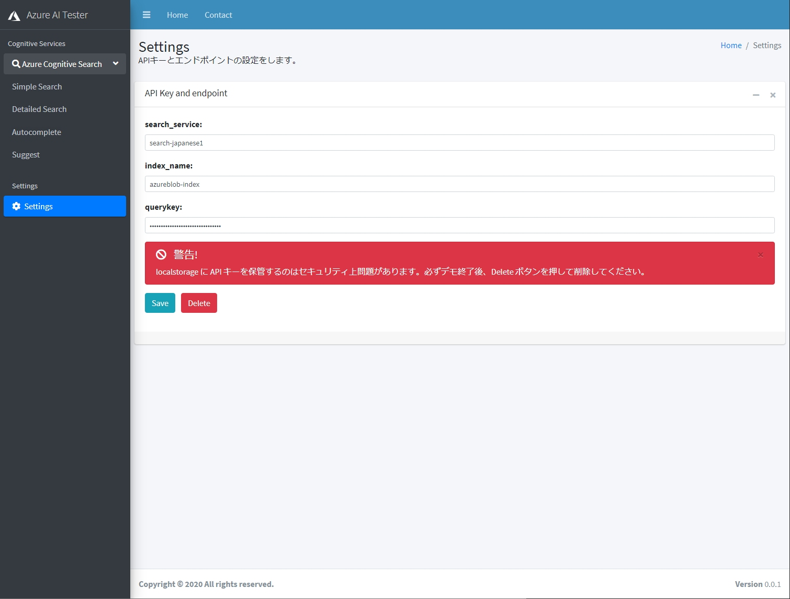
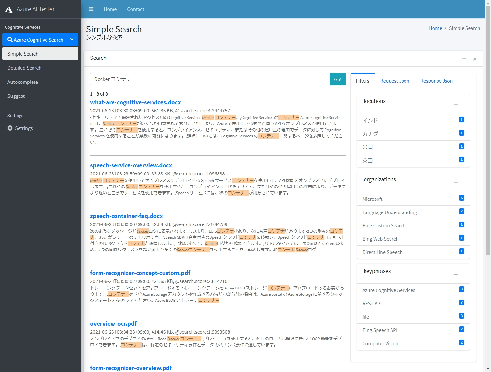

# はじめに
組織内に貯まっている大量な構造化・非構造化データから、新たな価値を見出すためのフルマネージド全文検索サービスである [Azure Cognitive Search](https://www.youtube.com/watch?v=jOzA48ZDyC4) を使えば、誰でも簡単に AI 搭載検索エンジンを開発することができます。今回は Azure Cognitive Search の検索機能をハンズオン形式でご紹介します。

# 目次
1. [Azure Cognitive Search とは](#Azure-Cognitive-Search-とは)

# フルテキスト検索
Azure Cognitive Search には、フリーテキスト検索から高度に指定されたクエリ パターンまで、さまざまなシナリオをサポートする豊富なクエリ言語が用意されています。このハンズオンでは、クエリ要求と、作成できるクエリの種類について説明します。

検索クエリの発行は、REST API で行います。検索クエリの送信には前回導入した Postman を使ってもよいですし、今回のハンズオン用に私が作成したクエリテスター GUI を利用することもできます。

本ハンズオンでは、Simple Cognitive Search Tester を使用します。

# 事前準備

## Simple Cognitive Search Tester のダウンロード
Simple Cognitive Search Tester は、今回のハンズオン用に私が用意したクエリテスト用の HTML ベース GUI です。[こちら](https://github.com/nohanaga/Azure-Cognitive-Search-Workshop/raw/89092a48ec9017db84210d3c485b4744d185843b/gui/simple-cognitive-search-tester.zip)からダウンロードできます。ダウンロードしたら、**simple-cognitive-search-tester.zip** ファイルを任意のフォルダに解凍してください。

## 接続情報の設定

simple-cognitive-search-tester ディレクトリ内に移動し、**settings.html** をブラウザで開きます。



検索クエリの実行に必要な、以下の情報を入力して「Save」をクリックします。入力した接続情報は、ブラウザの [localStorage](https://developer.mozilla.org/ja/docs/Web/API/Window/localStorage) に保存されます。

* `search_service`: Azure Cognitive Search サービスリソースの名前。検索対象の検索サービス名を設定します。
* `index_name`: 検索インデックスの名前。検索対象のインデックス名を指定します。
* `querykey`: Azure Cognitive Search サービスの API キー。検索クエリ用途のみですので、クエリキーのほうを使用します。これは Azure Portal の検索サービスの「設定メニュ→キー」からコピーします。

**注意**：localStorage に API キーを保管するのはセキュリティ上問題があります。今回一時的な使用のためだけに用意しています。必ずデモ終了後、Delete ボタンを押して削除してください。localStorage に API キーを保管したくない方は、各検索 html ページのソースコードの接続情報変数を直接編集してください。

接続情報が正しければ、インデックスを検索することができます。サイドメニューから、「Simple Search」をクリックして、検索ワードを入れて Enter キーを押してみてください。




# 1.フルテキスト検索
## Simple クエリ パーサー (フルテキスト検索に最適) 
Azure Cognitive Search には、2 種類のクエリ パーサーが用意されており、それぞれで実現可能な検索機能が異なります。設定できるのは、デフォルトの **Simple クエリ パーサー** (フルテキスト検索に最適) または、正規表現、近接検索、ファジー検索、ワイルドカード検索、フィールド検索、用語ブーストなど高度なクエリ構成で使用される **Full Lucene クエリ パーサー**です。

Simple Cognitive Search Tester では、「Simple Search」にデフォルトで Simple クエリ パーサーをセットしてあります。Full Lucene クエリ パーサーを使用したい場合は、「Detailed Search」の方を開いて **queryType** に **full** をセットします。

### ブール式の利用
Simple クエリ パーサーでは、AND、OR、NOT の論理式をサポートするために、文字 (+, -, |) の形式のブール演算子をサポートしています。

たとえば、

```
機械 学習
```

を検索するとします。「Detailed Search」を開いて、検索ボックスに上記ワードを入力します。Detailed Search ではデフォルトで、Simple クエリ パーサーがセットされています。


Postman などの REST API でクエリを発行したい方は、以下のクエリを投げてください。

```http
GET https://[service name].search.windows.net/indexes/[index name]/docs?[query parameters] 
    {  
      "search": "機械 学習",
      "api-version": "2020-06-30"
    }
```
