# はじめに
組織内に貯まっている大量な構造化・非構造化データから、新たな価値を見出すためのフルマネージド全文検索サービスである [Azure AI Search](https://www.youtube.com/watch?v=jOzA48ZDyC4) を使えば、誰でも簡単に AI 搭載検索エンジンを開発することができます。今回は Postman というツールを使って **REST API 経由**でインデックス開発を行うための方法をハンズオン形式で紹介します。

本ハンズオンを使うと [1,インデックスの作成](CreateIndex.md)と全く同じ検索インデックスを**効率的**に構築できます。

# 目次
1. [REST API 開発のすすめ](#rest-api-開発のすすめ)
1. [前提条件](#前提条件)
1. [Postman のインストール](#postman-のインストール)
1. [ファイルをインポートする](#ファイルをインポートする)
    1. [コレクションのインポート](#コレクションのインポート)
    1. [環境変数のインポート](#環境変数のインポート)
1. [REST API の実行](#rest-api-の実行)
    1. [データソースの作成](#1-データソースの作成)
        1. [リクエストパラメータ](#リクエストパラメータ)
        1. [リクエストヘッダー](#リクエストヘッダー)
        1. [リクエストボディ](#リクエストボディ)
        1. [リクエスト送信](#リクエスト送信)
    1. [インデックスの作成](#2-インデックスの作成)
    1. [スキルセットの作成](#3-スキルセットの作成)
    1. [インデクサーの作成](#4-インデクサーの作成)
    1. [インデクサーの実行](#5-インデクサーの実行)
    1. [インデクサーのステータス確認](#6-インデクサーのステータス確認)
    1. [インデックスの検索](#7-インデックスの検索)
    1. [アナライザーの分析](#8-アナライザーの分析)
1. [まとめ](#まとめ)

# REST API 開発のすすめ
Azure AI Search はあらゆるスキルレベルの方に対して、独自の検索エクスペリエンスを簡単に構築できるように開発されています。検索機能を追加する方法の 1 つとして、[REST API](https://docs.microsoft.com/ja-jp/azure/architecture/best-practices/api-design) を使用します。これには、インデックスの作成と管理、データの読み込み、検索機能の実装、クエリの実行、および結果の処理を行う操作が含まれます。

REST API での開発を行うと、Azure AI Search のすべての機能を扱うことができ、GUI 開発ではできない細かい部分の設定が可能です。また、Postman という REST API を呼ぶためのツールを活用することで、リクエストを細かく管理することができるので極めて効率的です。

本ハンズオンには、プログラムで検索インデックスを作成するために使用できる [Postman](https://www.postman.com/) コレクションと環境変数セットが含まれています。このコレクションは、Azure AI Search 機能の大部分を利用できるように事前構成されています。

# 前提条件

 - 有効な Azure サブスクリプションを持っていること

# Postman のインストール
REST API 開発がめちゃめちゃ捗ると人気の Postman をダウンロードしましょう。
まだインストールしていない場合は、[https://www.postman.com/downloads/](https://www.postman.com/downloads/)　にアクセスします。Windows, Mac, Linux, Web に対応しています。対象オペレーティングシステムの Postman をダウンロードしてインストールします。本ハンズオンでは、Windows 版 Postman v8.3.1 を用いて解説しますが、バージョンや環境によって画面デザイン等が若干異なる場合がございます。

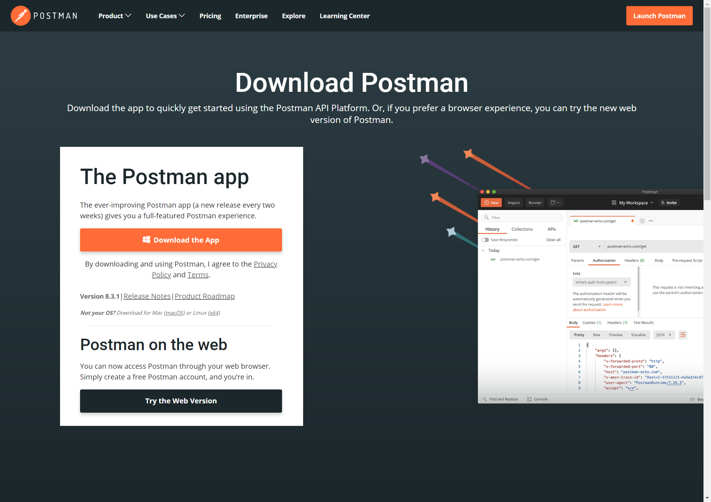

# ファイルをインポートする
今回インポートする JSON 設定ファイルには、REST API で検索インデックスを作成するために使用できる Postman コレクションと環境変数が含まれています。Postman を使用すると、API 呼び出しをパラメーター化し、API 呼び出しを編集してパイプラインをカスタマイズし、変更を簡単に共有および保持できます。

## コレクションのインポート
Postman UI を使用して、**Cognitive Search Pipeline APIs 2021.postman_collection.json** および **Cognitive Search Env 2021.postman_environment.json** をインポートします。

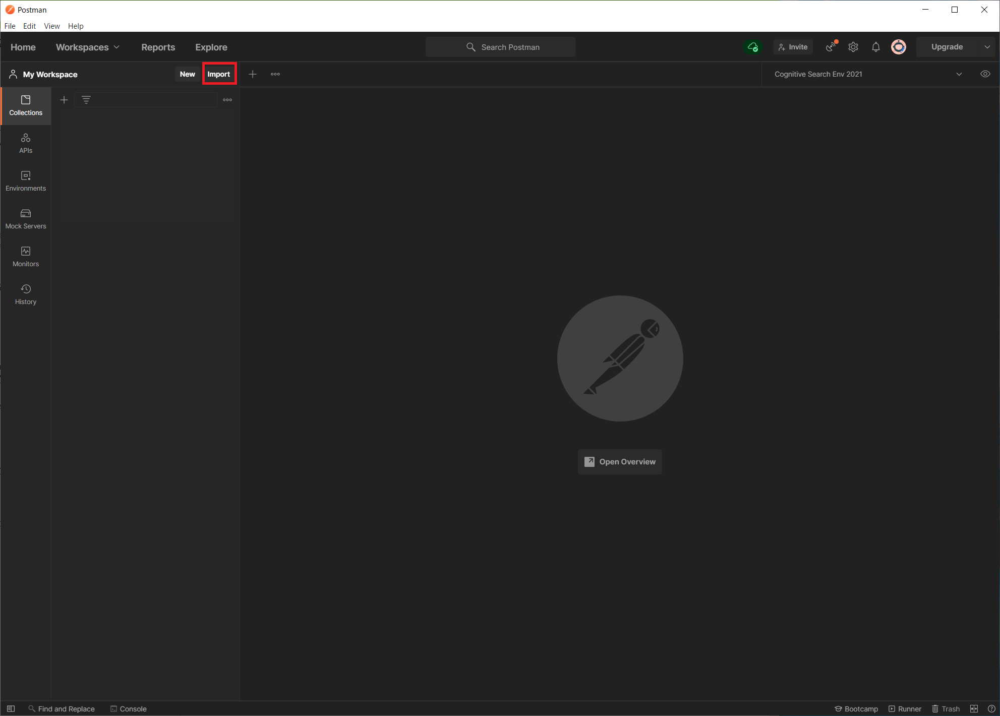

Postman が起動したら、画面上部の「Import」ボタンをクリックします。

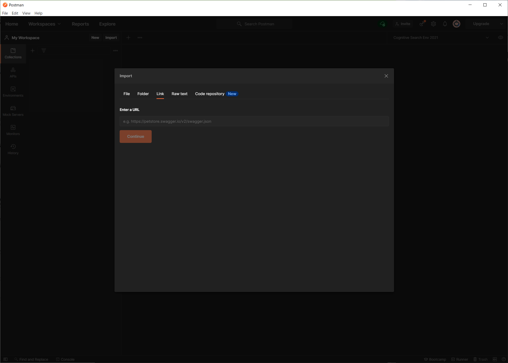

ファイルのインポート方法には、ローカルのファイル、フォルダだけでなく、URL も指定できます。
今回はコレクションと環境変数を私の [Github](https://github.com/nohanaga/AzureCognitiveSearchUsingPostman) 上に用意してありますので、以下の URL を入力して「Import」ボタンをクリックします。

```http
https://raw.githubusercontent.com/nohanaga/Azure-AI-Search-Workshop/main/postman/Cognitive%20Search%20Pipeline%20APIs%202021.postman_collection.json
```

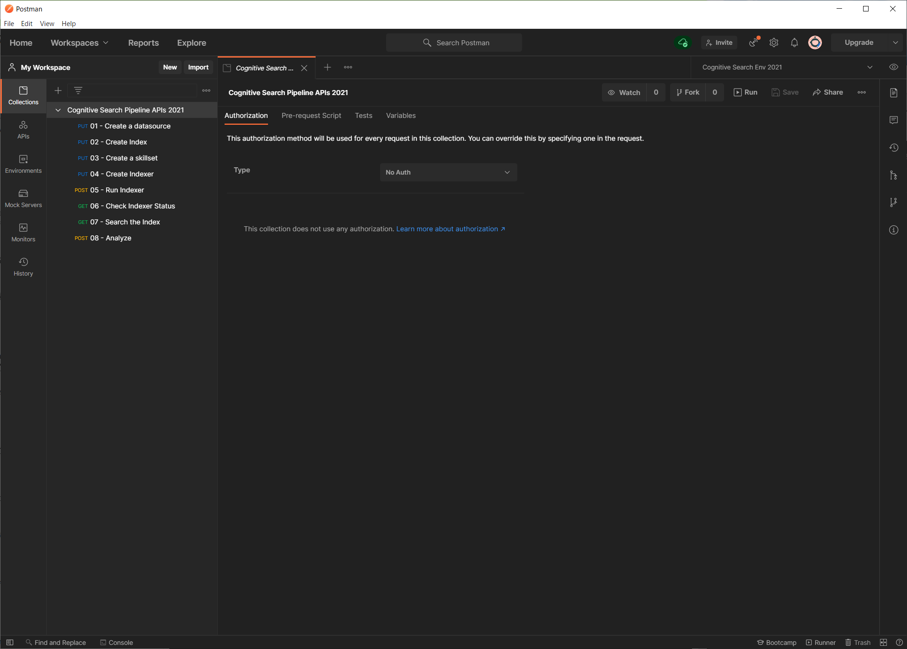

インポートが成功すると、今回私がよく使うものを厳選した Azure AI Search のインデックス開発を簡単に行うための API コレクションが追加されます。

以下のセットがメニューに表示されると思います。これを上から順に実行していくだけでインデックス開発が可能になります。作成だけであれば、1～4 までで OK です。

1. データソースの作成
1. インデックスの作成
1. スキルセットの作成
1. インデクサーの作成
1. インデクサーの実行
1. インデクサーのステータス確認
1. インデックスの検索
1. アナライザーの分析
1. オートコンプリートの実行
1. サジェストの実行

## 環境変数のインポート
もう一度インポート画面を開き、今度は環境変数ファイルをインポートします。

```http
https://raw.githubusercontent.com/nohanaga/Azure-AI-Search-Workshop/main/postman/Cognitive%20Search%20Env%202021.postman_environment.json
```

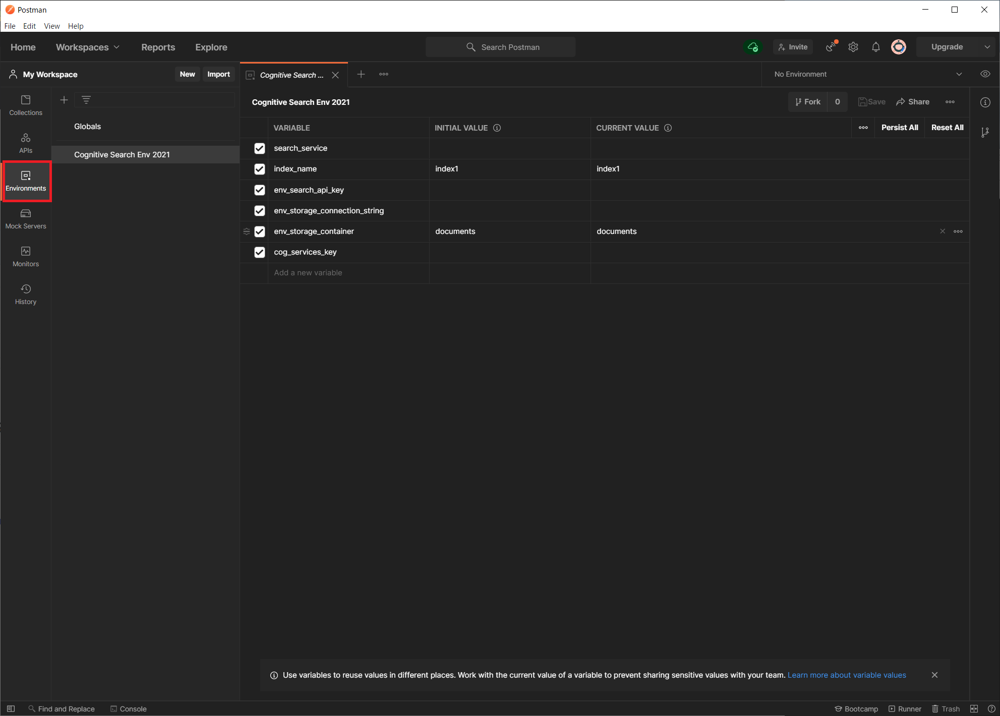

インポートが成功すると、API のリクエスト内で使用する変数のリストが表示されます。

 - `search_service`： Azure AI Search サービスリソースの名前。インデックス作成対象の検索サービス名を設定します。
 - `index_name`： 検索インデックスの名前。デフォルトで値が入っていますが自由に設定できます。前回 Azure Portal から作成したインデックス名とは違う名前を指定してください。
 - `env_search_api_key`： Azure AI Search サービスの API キー。API キーには管理者用と検索用の [2 種類](https://docs.microsoft.com/ja-jp/rest/api/searchservice/#key-authentication)ありますが今回は管理者キーをセットしています。検索クエリ用途のみの場合は、クエリキーのほうを使用します。これは Azure Portal の検索サービスの「設定メニュ→キー」からコピーします。
 - `env_storage_connection_string`： Blob ストレージアカウントの接続文字列。これは Azure Portal のストレージアカウントの「セキュリティとネットワークメニュー→アクセスキー」からコピーします。
 - `env_storage_container`： ドキュメントが含まれている Blob コンテナーの名前
 - `cog_services_key`： Cognitive Services のキー。これは Azure Portal からコピーします。今回のハンズオンでは使用しません。

こちらの環境変数に利用する値をあらかじめ定義しておけば、API リクエストの URL を毎度変更する必要がなくなります。

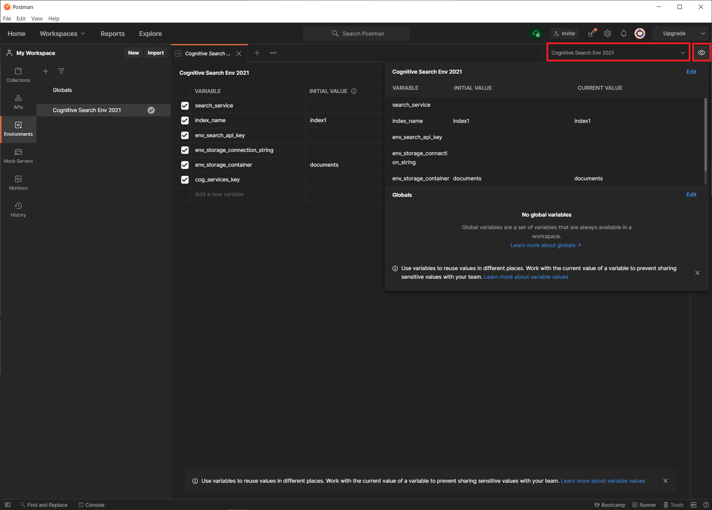

使用する環境変数のセットを切り替えるには、画面右上のドロップダウンを使います。右端の「👁」のボタンをクリックすると現在セットされている環境変数の値を確認・編集することができます。

# REST API の実行
それでは、インポートした API コレクションを上から実行していきながらインデックスを開発しましょう。

## 1. データソースの作成

まず最初にドキュメントを保管しているストレージへの接続を定義するデータソースを作成します。本ハンズオンのコレクションは、Azure Blob ストレージがプライマリデータソースであることを前提としています。

Postman の使い方の紹介も含めて、詳しく説明していきます。

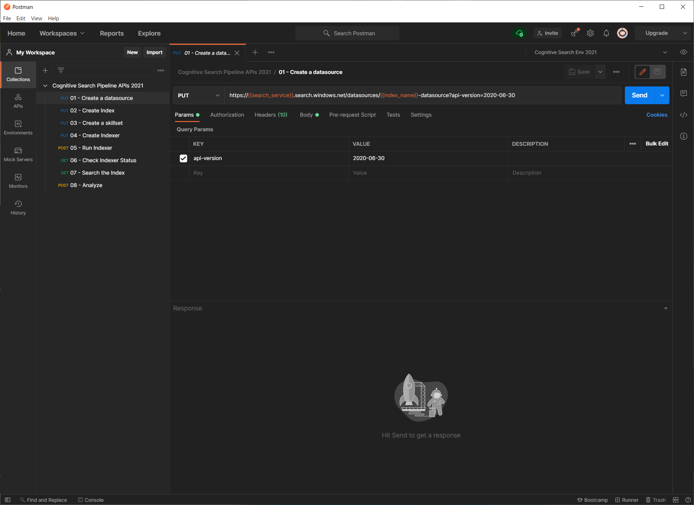

コレクションから、`01 - Create a datasource` を選択すると、Postman の右ペインにリクエストタブが開きます。

### リクエスト URL

リクエスト URL は、Azure AI Search の持つ機能を表します。

画面上部には、リクエストの HTTP メソッドと、API エンドポイント URL、そして「Send」ボタンが表示されます。API エンドポイント URL には変数を含んだ形でセットされおり、必ず HTTPS でなければなりません。`{{search_service}}` の部分が変数で、画面右上の環境変数によってこの中にセットする値を切り替えることができます。

今回はデータソース名やインデクサー名、スキルセット名にはプレフィックスとしてインデックス名 `{{index_name}}` を付加するように記述しています。

画面中央部には リクエストパラメータや認証、ヘッダー、本文などをそれぞれ設定できます。

### リクエストパラメータ
上図のパラメータタブではリクエストパラメータとして `api-version` がセットされています。リクエストにはかならずこの API バージョンを指定する必要があります。現時点での最新安定版をセットしてあります。指定可能な API バージョンの一覧は[こちら](https://docs.microsoft.com/azure/search/search-api-versions#search-service-apis)にあります。

### リクエストヘッダー
リクエストヘッダータブでは、API のリクエストに必要な `api-key` がセットされています。リクエストヘッダーには、デプロイした検索サービスに対して生成された API キー を含める必要があります。 有効なキーがあれば、要求を送信するアプリケーションとそれを処理するサービスの間で、要求ごとに信頼を確立できます。

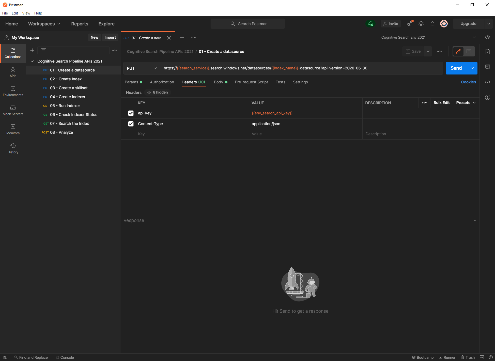

Azure Portal の検索サービスから管理者キーをコピーし、環境変数の、`env_search_api_key` にセットします。

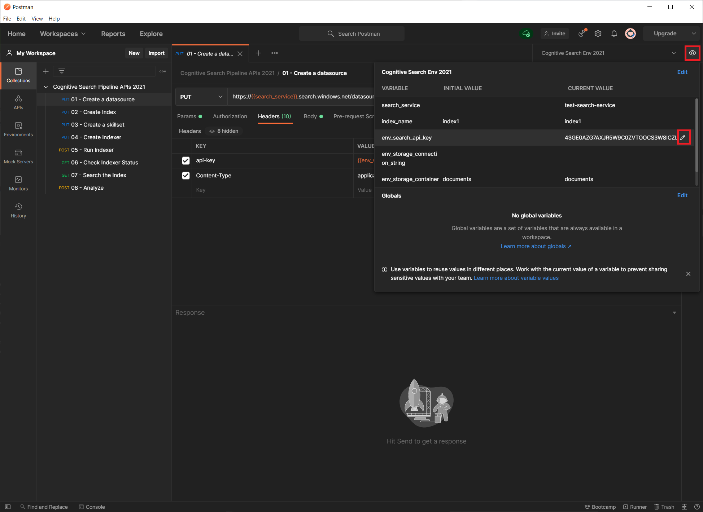

環境変数の値をセットするには、右端の「👁」のボタンをクリックし、`env_search_api_key` の行の `CURRENT VALUE` 項 で「✎」アイコンをクリックして入力します。

### リクエストボディ

ボディタブには、API で送信するリクエスト本文が定義されています。

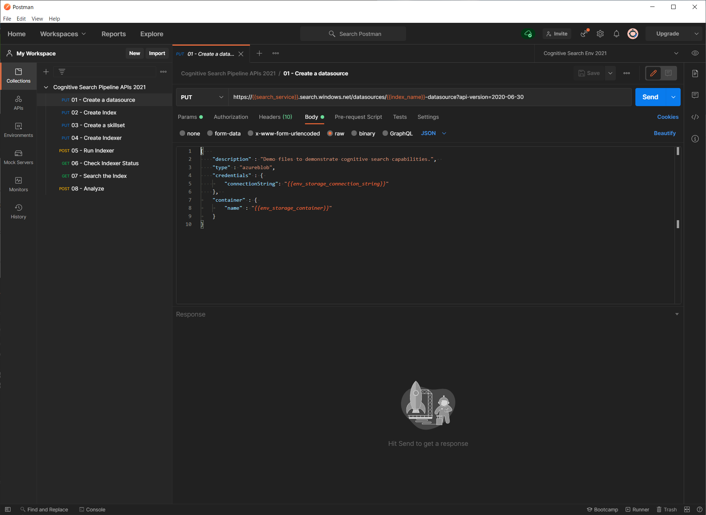

データソースの作成に必要な情報として、Azure Blob Storage への接続情報と、検索対象のドキュメントが保管されている Blob コンテナーの名前が必要です。どちらも変数になっているので、右端の「👁」のボタンをクリックし、`env_storage_connection_string` と `env_storage_container` に値をセットしてください。

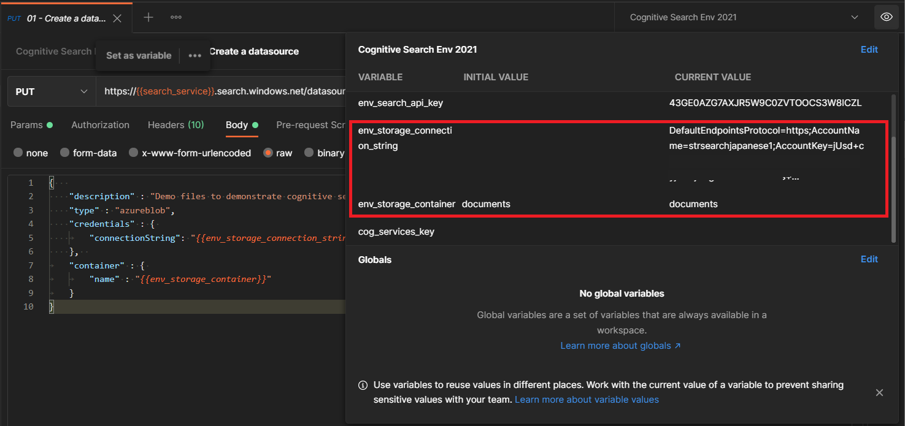

### リクエスト送信

環境変数のセットが完了したら、URL ボックスの右にある「Send」ボタンをクリックしてリクエストを送信します。

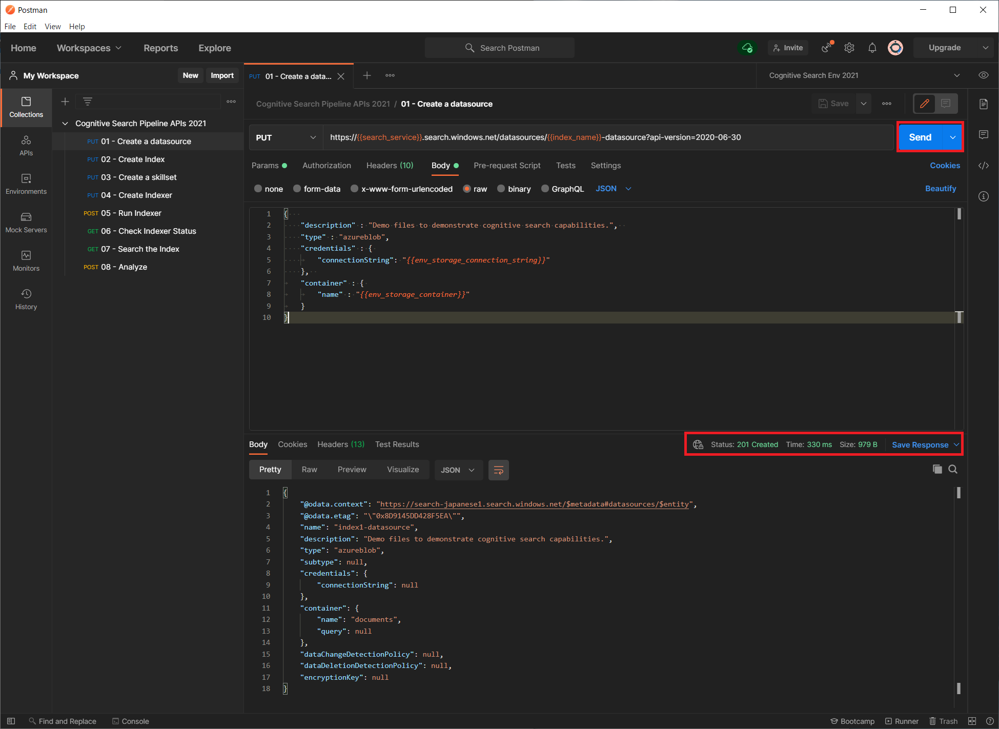

送信したリクエストのレスポンスは右ペインの下部に表示されます。レスポンスのステータスコードが、`201 Created` となれば成功です。レスポンスボディには、返却されたデータソース設定情報が表示されます。

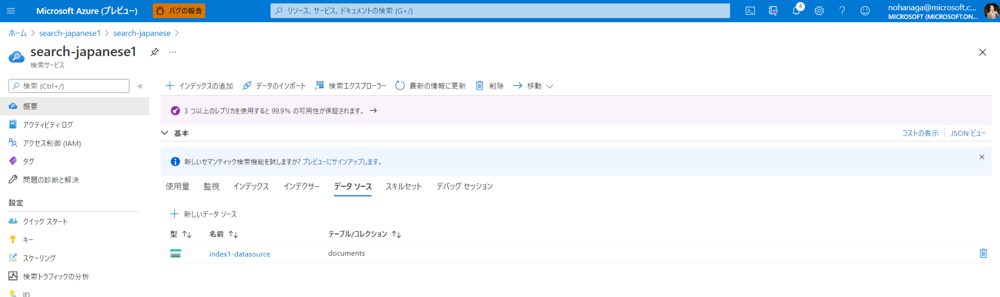

Azure Portal から対象の検索サービスを開き、「データソース」タブを見てみると先ほど登録したデータソースが表示されていることが確認できます。

## 2. インデックスの作成
API コレクションから、`02 - Create Index` を選択します。リクエストボディを見ていただくと、今回作成するインデックスフィールドの定義がセットされていることが分かります。

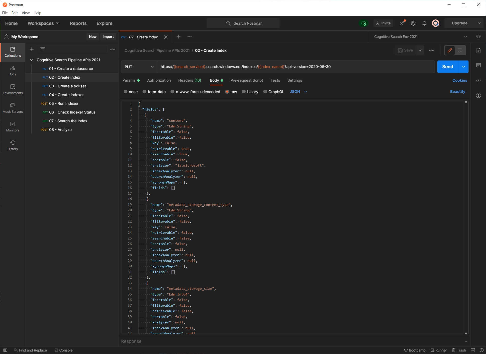

まずは内容を変更せず、「Send」ボタンをクリックし、レスポンスのステータスコードが、`201 Created` となれば成功です。[こちら](CreateIndex.md)と同じ設定でインデックスフィールドが作成されます。

インデックスの作成 API では、GUI 上から設定することができない[組み込みアナライザー](https://docs.microsoft.com/azure/search/index-add-custom-analyzers#built-in-analyzers)や、[カスタムアナライザー](https://docs.microsoft.com/azure/search/index-add-custom-analyzers)の定義を行うことができます。また、フィールドごとに同義語辞書 [synonymMaps](https://docs.microsoft.com/azure/search/search-synonyms) を紐づけることも可能です。

## 3. スキルセットの作成

API コレクションから、`03 - Create a skillset` を選択します。リクエストボディを見ていただくと、今回作成するスキルセットの定義がセットされていることが分かります。

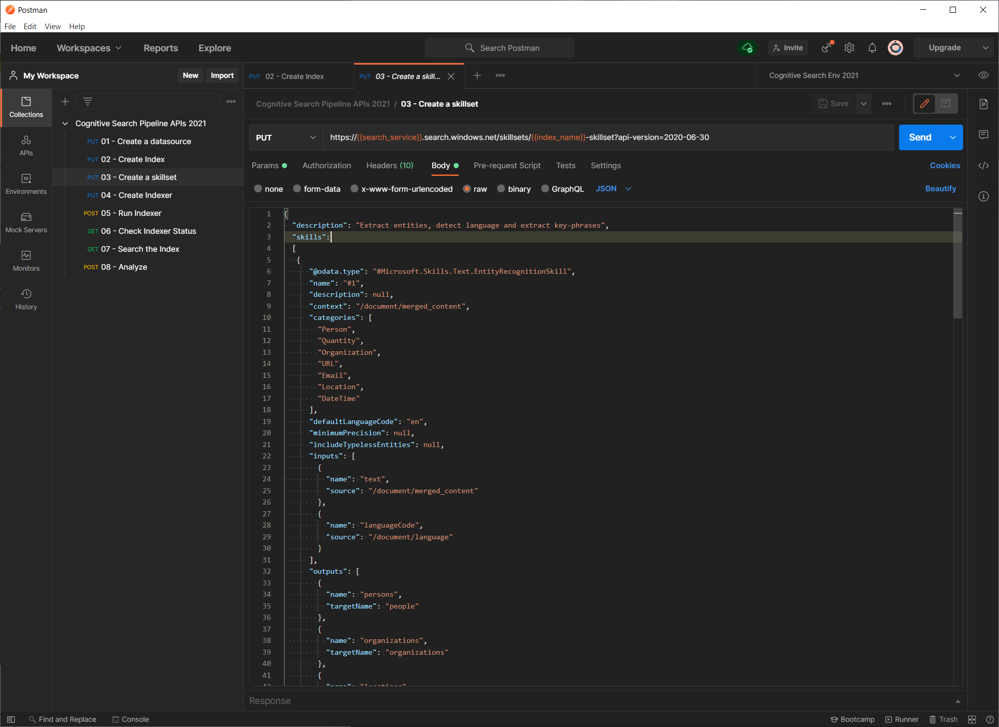

内容を変更せず、「Send」ボタンをクリックし、レスポンスのステータスコードが、`201 Created` となれば成功です。[こちら](CreateIndex.md)と同じ設定でスキルセットが作成されます。

## 4. インデクサーの作成

API コレクションから、`04 - Create Indexer` を選択します。リクエストボディを見ていただくと、今回作成するインデクサーの定義がセットされていることが分かります。

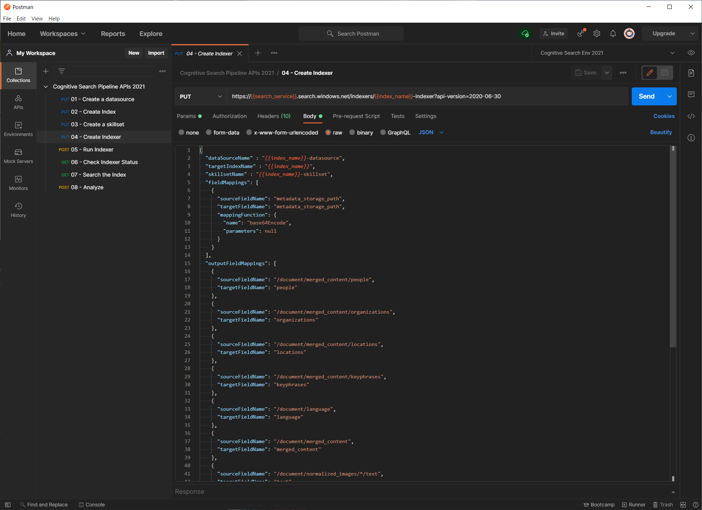

インデクサー定義の中では、データソース名、インデックス名、スキルセット名を記載する必要がありますが、このように変数を利用していますので、毎回この定義を編集する必要はありません。アウトプットフィールドのマッピングは直接 JSON を編集する方法の他に[デバッグセッションを利用](https://qiita.com/nohanaga/items/26355ffba58ba4c71c6e#%E5%87%BA%E5%8A%9B%E3%83%95%E3%82%A3%E3%83%BC%E3%83%AB%E3%83%89%E3%81%AE%E3%83%9E%E3%83%83%E3%83%94%E3%83%B3%E3%82%B0)することもできます。

内容を変更せず、「Send」ボタンをクリックし、レスポンスのステータスコードが、`201 Created` となれば成功です。インデクサーの場合は、作成成功と同時にスケジュール設定に従って実行されます。今回は 1 度実行にしてありますので、すでにインデクサーのクローリングが 1 回実行されています。

## 5. インデクサーの実行

今回はインデクサー作成時に自動的にクローリングが実行されましたが、任意のタイミングでクローリングを実施したい場合は、この API を実行します。

API コレクションから、`05 - Run Indexer` を選択します。リクエストボディはありません。そのまま「Send」をクリックします。リクエストが成功した場合、`202 Accepted` が返却されます。すでにインデクサーが実行中の場合は失敗します。

## 6. インデクサーのステータス確認

API コレクションから、`06 - Check Indexer Status` を選択します。リクエストボディはありません。そのまま「Send」をクリックします。リクエストが成功した場合、`200 OK` が返却されます。対象インデクサーのステータス、実行履歴の情報が返されます。

## 7. インデックスの検索
API コレクションから、`07 - Search the Index` を選択します。検索クエリのリクエストは GET メソッドを使用し、クエリはリクエストパラメータ内の `search` に記述します。このリクエストは GET だけでなく POST も使えます。GET と POST でクエリパラメータの指定方法に違いがあり、これがミスの原因として多いので、[こちら](https://docs.microsoft.com/rest/api/searchservice/search-documents)の検索クエリのヘルプを参照してください。

デフォルトでは、`search` に `*`（全検索）が入っていますのでそのまま「Send」をクリックします。リクエストが成功した場合、`200 OK` が返却されます。Azure AI Search によるインデックス検索結果が返却されます。

## 8. アナライザーの分析
インデックスフィールドには、アナライザーを指定しますが、このアナライザーがどのようにテキストをトークナイズしているのかを調べることができます。

API コレクションから、`08 - Analyze` を選択します。

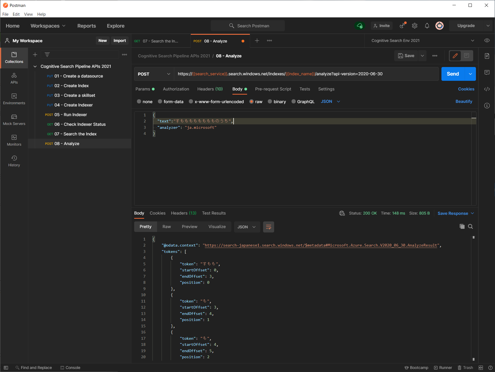

`text` に分析したいテキストを入力し、`analyzer` に分析したいアナライザー名を指定します。アナライザー名には、[言語アナライザー](https://docs.microsoft.com/ja-jp/azure/search/index-add-language-analyzers#supported-language-analyzers)や、[組み込みアナライザー](https://docs.microsoft.com/azure/search/index-add-custom-analyzers#built-in-analyzers)だけでなく、[カスタムアナライザー](https://docs.microsoft.com/azure/search/index-add-custom-analyzers)名も指定することができます。また、トークナイザーやトークンフィルターを[直接指定する方法](https://docs.microsoft.com/rest/api/searchservice/test-analyzer)もあります。

アナライザーを設定した特定のフィールドへのクエリが正しく語句解析されているかどうかを分析する場合に使用できます。

# まとめ
以上で、Azure AI Search のインデックス開発を Postman を使って効率化する方法をご紹介しました。Postman を使えば、開発環境ごとに環境変数を入れ替えたり、プロジェクトごとに API コレクションを準備できるので重宝します。Postman のオンラインアカウントを登録することで、設定をクラウドと同期させることもできます。

今回ご紹介した API コレクションをベースに開発することで、皆様のナレッジマイニングライフが効率的になれば幸いです。
